**The code to accompany this post is "[Accessible Text Descriptions For Images](https://github.com/anthonycosgrave/fasthtml-web-a11y/tree/main/accessible-text-descriptions-for-images)". Screen reader required!**

Images are often essential content. Product photos, charts, diagrams, buttons and promotional banners can all communicate information that may not exist elsewhere on the page.

When someone cannot see an image - for example because they are blind and using a screen reader, the image fails to load due to a CDN (Content Delivery Network) outage or, they have disabled image loading to save on bandwidth - that information can be lost unless an alternative is provided.

WCAG success criterion ([1.1.1 Non-text Content (Level A)](https://www.w3.org/WAI/WCAG22/Understanding/non-text-content.html)) requires that:

> *"All non-text content presented to a user must have a text alternative that serves the equivalent purpose."*

Despite this long-standing baseline - Level A - web accessibility requirement, the 2026 Web AIM Millions project found [16.2% of all home page images](https://webaim.org/projects/million/#alttext) (almost 11 images per page) were missing appropriate alternative text - more commonly known as "`alt` text".

<table-of-contents selector="h2, h3, h4, h5" summary="Overview"></table-of-contents>

## What is `alt` text?
The HTML [`alt`](https://developer.mozilla.org/en-US/docs/Web/API/HTMLImageElement/alt) attribute on `` elements (`Image()` in FastHTML) provides the text alternative WCAG requires. If the image cannot load and `alt` has been provided, it will be displayed in the browser instead of the image.

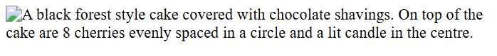

Alt text becomes the image's "accessible name" (what a screen reader will announce) and appears in the accessibility tree - see ["Intro to the Accessibility Tree"](../fasthtml-web-a11y/intro-accessibility-tree.md#the-accessibility-tree) for a recap - making it available to assistive technologies like screen readers.

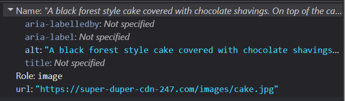

## Types of images
Not all images serve the same purpose, and their `alt` text should reflect that. A decorative section divider, a product photo and a chart all have different accessibility needs.

Every `` must have an `alt` **attribute**, but not every image needs an `alt` text **value**.

Without an `alt` attribute present, a screen reader may create a confusing experience by announcing the missing image as: 
- *"Unlabelled graphic"*.  
- *"Graphic. To get missing image description, open the context menu."*.  
- or, read out the **full url and image filename** from the `src` attribute.  

### Decorative
Decorative images are purely for visual appeal. They do not convey information required to understand the content or perform tasks on the page.

The `alt` attribute should be present but **empty** so screen readers know to ignore the image. 

**Empty `alt` text contains NOTHING - not even whitespace**

```python
# Incorrect: whitespace is NOT an empty value
H1(Image(src='loud-speaker.png', alt=' '), 'Announcements!')
```

```python
# Correct
H1(Image(src='loud-speaker.png', alt=''), 'Announcements!')
```

Visually there will be no difference:


However, there will be a **significant** difference in what is exposed to screen readers via the accessibility tree. Whitespace is treated as actual text content, so incorrectly the image will be included in the accessibility tree:

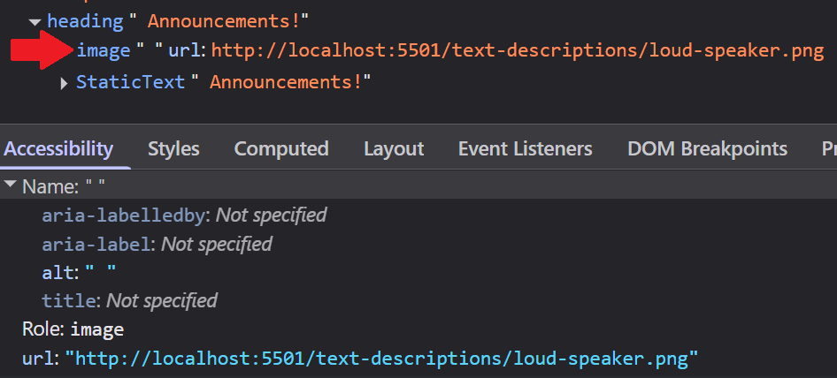

And this is how it will be announced by a screen reader (NVDA in this example).

<lite-youtube videoid="J-UoJbgQonA" title="Whitespace Alt Text Example with NVDA" style="background-image: url('https://i.ytimg.com/vi/J-UoJbgQonA/hqdefault.jpg');">
  <a href="https://youtu.be/J-UoJbgQonA" class="lyt-playbtn" title="Play Video">
    <span class="lyt-visually-hidden">Play Video: Whitespace Alt Text Example with NVDA</span>
  </a>
</lite-youtube>

The empty `alt` text is correctly excluded from the accessibility tree. Also note that DevTools identify that "*Element has empty alt text.*"

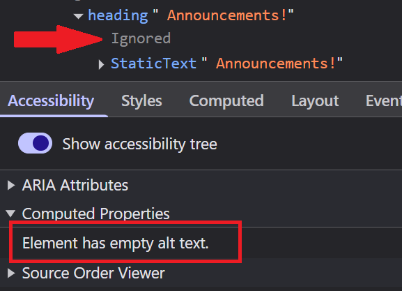

### Functional
Functional images are part of controls - e.g. company logo links, a "Save" button icon. The `alt` text details were covered in previous posts - ["Don't create empty buttons"](../fasthtml-web-a11y/empty-buttons.md#alt-text-tips) and ["Don't create empty links"](../fasthtml-web-a11y/empty-links.md#alt-text-tips-for-functional-images). 

To summarise the `alt` text should:  
- Tell the person what will happen if they activate the button.  
- Tell the person where link goes or what happens if it is activated.   

### Images of text
These are stylised images typically used to promote products, sales and events. Avoid images of text as they can present several accessibility issues for people who rely on page zooming, screen magnification, or high contrast colour modes. 


A more accessible solution is to use native HTML and CSS to achieve the same visual presentation. The stricter Level AAA success criterion - [1.4.9 Images of Text (No Exception)](https://www.w3.org/WAI/WCAG22/Understanding/images-of-text-no-exception.html) - states that all text should be actual text unless it is used for decorative purposes or the type presentation is absolutely essential.

If you must use an image of text then the `alt` text must contain the **same words as the image**.

### Complex
Complex images contain detailed information, structure or relationships that can't be communicated in a short phrase or single sentence. Examples include infographics, graphs, maps and charts.

The `alt` text must be a **very brief summary** of the image's most important information, not a full description, and where appropriate, indicates where the full description can be found. The full detailed description should be provided separately.

The full description must also be provided as visible text that assistive technology can access. 

If the image represents structured information like chart data, provide that information in a structured format such as a table. Screen readers have built-in keyboard commands specifically for navigating tables. 

This example from [WebAIM](https://webaim.org/projects/million/#wcag) showing "*The percentage of pages with most common errors*". The the `alt` text communicates the main takeaway without including every value and where the longer description is located: 

> *"Bar chart showing percentage of homepages with each error type from 2019 to 2026. Full data for this chart is below."*

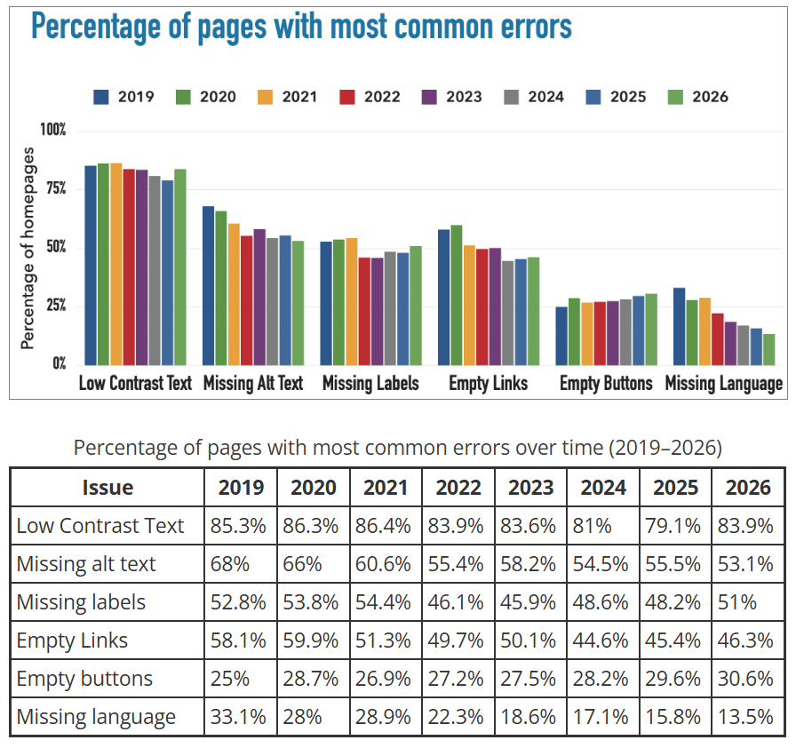

There are several valid ways to provide the longer description depending on the complexity of the image and how much detail is required:

1. Provide the description immediately after the image e.g. in the next paragraph.   
2. Wrap the `` inside a [`<figure>`](https://developer.mozilla.org/en-US/docs/Web/HTML/Reference/Elements/figure) and provide the description inside the [`<figcaption>`](https://developer.mozilla.org/en-US/docs/Web/HTML/Reference/Elements/figcaption).  

If including the description would interrupt the reading flow:

3. A ["disclosure component"](https://developer.mozilla.org/en-US/docs/Web/HTML/Reference/Elements/details) using the `<details>` and `<summary>` elements can hide the longer description until requested by the reader. The image is placed inside the `<summary></summary>` element and the description is placed after it. Be aware that it may be necessary to override some default/3rd party CSS framework styling rules to "shrink-wrap" the `<summary>` around the `` and remove the default disclosure triangle. A working example is included in this post's accompanying [source code](https://github.com/anthonycosgrave/fasthtml-web-a11y/tree/main/accessible-text-descriptions-for-images).

4. Place it in an appendix section further down the page or on a separate page entirely, with a link adjacent to the image. 

If the description does not rely on structure such as ordered lists or tables:

5. Use [`aria-describedby`](https://developer.mozilla.org/en-US/docs/Web/Accessibility/ARIA/Reference/Attributes/aria-describedby) to associate a plain text description with the image using an element id. The description element must have a **unique id** and must exist on the same page. Many screen readers flatten or simplifiy structured markup when announcing `aria-describedby` content, making it less suitable for complex structured descriptions.

### Informative
Informative images are not directly discussed in the page but they add to the reader's experience or provide some complementary information in some way. For example photos of people, pets, objects and products. 

The `alt` text should not describe every visible detail, but instead **describe what in the image is relevant to the surrounding content**. 

For example, an article about blindness and assistive reading methods might include an image related to braille.


> *"A close-up of a pair of hands resting on an open book with fingertips reading a page of braille."*

It would be unnecessary to describe the size of the hands, position of each finger or the colour of the pages.

## Text descriptions for inline `<svg>`

The [`<svg>`](https://developer.mozilla.org/en-US/docs/Web/SVG) element does not have an `alt` attribute and requires a slightly different approach, but same logic for image types applies.

Accessible text descriptions for SVGs can be provided using:
- the [`<title>`](https://developer.mozilla.org/en-US/docs/Web/SVG/Reference/Element/title) element.  
- the [`<desc>`](https://developer.mozilla.org/en-US/docs/Web/SVG/Reference/Element/desc) element.  
- the [`aria-labelledby`](https://developer.mozilla.org/en-US/docs/Web/Accessibility/ARIA/Reference/Attributes/aria-labelledby).   attribute  

### Decorative `<svg>`
Like the page divider image below, decorative `<svg>` do not require a text description and should be **hidden** from the accessibility tree using `aria-hidden="true"`.


```python
Svg(
    Path(d="M0 50 C80 20,160 70,240 45 C320 20,400 65,480 40 C560 15,620 55,680 35",
         fill="none", stroke="#6ea8d8", stroke_width="2", opacity="0.9"),
    Path(d="M0 55 C90 30,170 72,250 50 C330 28,410 68,490 46 C570 24,630 58,680 42",
         fill="none", stroke="#4a7fb5", stroke_width="1.5", opacity="0.6"),
    Path(d="M0 60 C70 38,150 75,230 55 C310 35,390 72,470 52 C550 32,625 62,680 48",
         fill="none", stroke="#2c5f8a", stroke_width="1", opacity="0.35"),
     aria_hidden="true",
     xmlns="http://www.w3.org/2000/svg",
     width="100%",
     viewBox="0 0 680 80",
)
```

### Functional `<svg>`
How to deal with inline `<svg>` elements has been specifically covered in both of the following earlier posts:

- ["Don't create empty buttons"](../fasthtml-web-a11y/empty-buttons.md#when-using-inline-svg)  
- ["Don't create empty links"](../fasthtml-web-a11y/empty-links.md#when-using-inline-svg-images)  

### Informative and Complex `<svg>`
Informative and complex SVGs require accessible text descriptions.

An additional important step is adding `role='img'` to the `<svg>` element. This helps assistive technologies treat the SVG as a **single image** instead of exposing internal SVG structure and content individually. Without `role='img'`, some browsers and screen readers may expose SVG elements as `SVGRoot`, `graphics-document`, `graphics-symbol`, as well as individual symbols or paths.

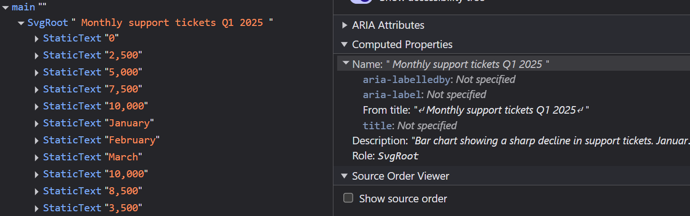

Here is an example of NVDA reading out every bit of text exposed to it from inside the SVG.

<lite-youtube videoid="t2hE8XwPfdM" title="SVG without role='img' Example with NVDA" style="background-image: url('https://i.ytimg.com/vi/t2hE8XwPfdM/hqdefault.jpg');">
  <a href="https://youtu.be/t2hE8XwPfdM" class="lyt-playbtn" title="Play Video">
    <span class="lyt-visually-hidden">Play Video: SVG without role='img' Example with NVDA</span>
  </a>
</lite-youtube>

Use:

- `<title>` for a *short* text description.  
- `<desc>` for a longer description.  
- `aria-labelledby` associates the `<svg>` with those descriptions by their ids.

The `id` values referenced by `aria-labelledby` must be **unique** within the page.

`<title>` and `<desc>` are accessibility features and are not rendered as visible text on the page. (In some browsers `<title>` may appear as a "tooltip" when the mouse pointer hovers over it).

```python
Svg(
    Title('Monthly support tickets Q1 2026', id='chart-title'),
    Desc('Bar chart showing a sharp decline in support tickets. There were 10000 in January, 8500 in February, and 3500 in March',  id='chart-desc'),
    Line(x1='80', y1='20', x2='80', y2='200', stroke='#888', stroke_width='1'),
    ...
    ...,
    Text('3,500', x='490', y='138', text_anchor='middle'),
    role='img',
    aria_labelledby='chart-title chart-desc',
    width='100%',
    viewBox='0 0 680 260',
    xmlns='http://www.w3.org/2000/svg'
)
```
The SVG as it appears in the accessibility tree with the `role='img'` ARIA attribute.

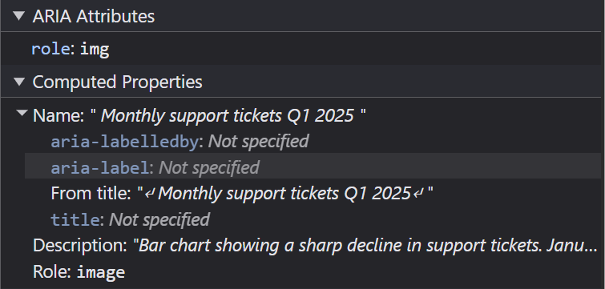

Unlike the previous example without `role='img`' a screen reader will only announce the parts that are available to it:

<lite-youtube videoid="kvlFb53pjtE" title="SVG with role='img' and accessible text description example with NVDA" style="background-image: url('https://i.ytimg.com/vi/kvlFb53pjtE/hqdefault.jpg');">
  <a href="https://youtube.com/shorts/kvlFb53pjtE" class="lyt-playbtn" title="Play Video">
    <span class="lyt-visually-hidden">Play Video: SVG with role='img' and accessible text description example with NVDA</span>
  </a>
</lite-youtube>

Complex SVGs follow the same rules discussed earlier for other complex images. If the SVG contains detailed information such as chart data, provide a visible text alternative elsewhere on the page such as a table or extended description.

## Writing good alt text descriptions
Think of `alt` text as what the image *means* in the context of the page, not just what it is an image of.

The [HTML Standard](https://html.spec.whatwg.org/multipage/images.html#alt) provides a great tip:

> *"One way to think of alternative text is to think about how you would 
> read the page containing the image to someone over the phone, without 
> mentioning that there is an image present. Whatever you say instead of 
> the image is typically a good start for writing the alternative text."*

**Be as concise as possible, but as detailed as needed.**

### Common mistakes
Good `alt` text is a balancing act and it is crucial to avoid these common mistakes:

1. Including "`An image of`", "`A photo of`" etc. This is unnecessary duplication because a screen reader will already announce that it is an image. Exceptions to this would be "`An oil painting of`", "`A screenshot of`" etc. where that detail helps to convey additional information.  
2. Being **too short**, e.g. `alt="cake"` gives no useful information.   
3. Being **too long**, e.g. describing every shadow or crease of the table cloth and place settings surrounding the cake.   
4. Cramming in SEO keywords. e.g. `alt="Black Forest cake dessert chocolate cherries bakery baking best cake celebration"`. These don't describe the important features of the image, you're spamming the person!
5. Including photographer credits or attributions.   
6. Using emojis - they rarely improve descriptions and can create broken screen reader output.

### Punctuation
Use correct punctuation throughout and end with a **full stop**. The full stop will cause the screen reader to pause briefly giving the listener a moment to take in the previous announcement.

### How to describe people in images
Context matters. Only include characteristics - e.g. gender, ethnicity, religion - when relevant to the content.

Be neutral and factual. 

For example, an article about a health condition that predominantly affects men in their 50s:


> *"a middle-aged man in a hospital gown sits on a hospital bed, leaning forward with his hands clasped together and his chin resting on them. He stares down at the ground, appearing deep in thought."*

Or, a profile of footballer Nouhaila Benzina the first player to wear a hijab at a World Cup.


Her identity would be central to the story.  

> *"Moroccan defender Nouhaila Benzina looks down at the ball during a Women's World Cup match, 
> right leg drawn back to kick the ball in front of her. She wears an all-white kit with her 
> surname and the number 3 on the back, white leggings, a white hijab and light blue boots. A 
> crowd watches in the background."*

### Why not just make every image "decorative"?
It may be tempting to think about treating all your images as "decorative" to avoid having to tackle the `alt` text and silence accessibility warnings. This is not making content accessible; it is just hiding it.

## Testing for alt text issues
Automated accessibility checkers like Google Lighthouse and the WebAIM WAVE tool can detect missing `alt` text but cannot provide guidance on the quality of the text.

The best way to evaluate `alt` text is to:
- navigate the page with a screen reader.  
- disable image loading temporarily.  
- or inspect the accessibility tree in browser DevTools.  

These approaches help reveal how the image is actually exposed to assistive technologies.

### WebAIM's WAVE Tool
Available as a [browser extension](https://chromewebstore.google.com/detail/jbbplnpkjmmeebjpijfedlgcdilocofh?utm_source=item-share-cb) and launchable from the browser extension toolbar or via the right click context menu and selecting the "WAVE this page" option.

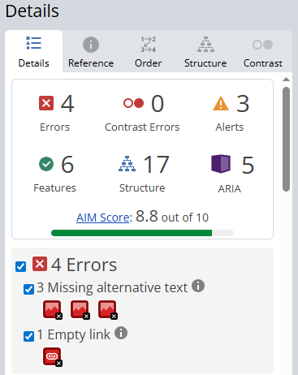

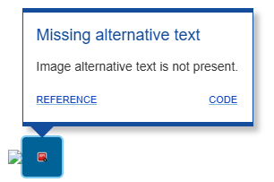

### Google Lighthouse 
[Lighthouse](https://developer.chrome.com/docs/lighthouse/overview#devtools) is available in Chrome (and almost all Chromium based browser) DevTools.

1. Open the Command Palette `Ctrl + Shift + P` (Windows) or `Cmd + Shift + P` (MacOS).
2. Type "Lighthouse". 
3. Press Enter or click on "Show Lighthouse".
4. Check the "Accessibility" checkbox under the "Categories" heading.
5. Click the "Analyze page load" button to begin generating the report.

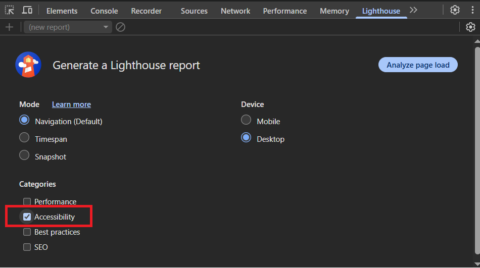

And this is how `alt` text issues are reported by Lighthouse:

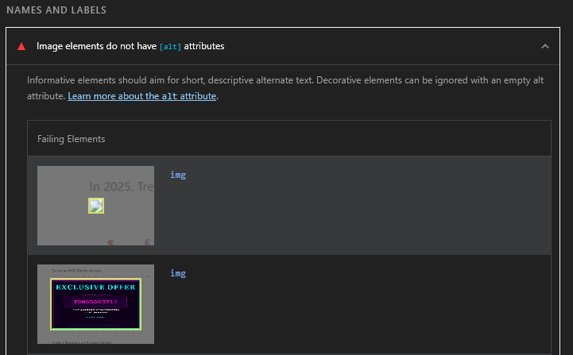

### Using LLMs to generate text descriptions of images
LLMs can help generate draft `alt` text if given an image, but they often lack the surrounding page context needed to determine what information is actually important. 

The same image may require different `alt` text depending on:
- the purpose of the page.  
- the surrounding content.  
- whether the image is decorative, informative or functional.  

Generated descriptions should therefore be reviewed and edited manually.

## Additional resources
This post focuses on the most common image accessibility patterns and beginner-friendly approaches to writing effective `alt` text.

There are many instances of where you may need to use images in your web app or site. The Web Accessibility Initiative (WAI) provides a thorough list for almost every situation: [WAI Images Tutorial](https://www.w3.org/WAI/tutorials/images/).

## WCAG Success Criteria
These WCAG success criteria relate to the accessibility topics covered in this post.

**[1.1.1 Non-text Content (Level A)](https://www.w3.org/WAI/WCAG22/Understanding/non-text-content.html)** - All non-text content presented to a user must have a text alternative that serves the equivalent purpose.

**[1.4.5 Images of Text (Level AA)](https://www.w3.org/WAI/WCAG22/Understanding/images-of-text.html)** - If the technologies being used can achieve the visual presentation, text is used to convey information rather than images of text.

**[1.4.9 Images of Text (No Exception) (Level AAA)](https://www.w3.org/WAI/WCAG22/Understanding/images-of-text-no-exception.html)** - Images of text are only used for pure decoration or where a particular presentation of text is essential to the information being conveyed.

## Image Source Credits
<a href="https://pixabay.com/users/clker-free-vector-images-3736/?utm_source=link-attribution&utm_medium=referral&utm_campaign=image&utm_content=33944">Clker-Free-Vector-Images</a> from <a href="https://pixabay.com//?utm_source=link-attribution&utm_medium=referral&utm_campaign=image&utm_content=33944">Pixabay</a>

<a href="https://pixabay.com/users/myriams-fotos-1627417/?utm_source=link-attribution&utm_medium=referral&utm_campaign=image&utm_content=5498805">Myriams-Fotos</a> from <a href="https://pixabay.com//?utm_source=link-attribution&utm_medium=referral&utm_campaign=image&utm_content=5498805">Pixabay</a>

[Photo by Tima Miroshnichenko](https://www.pexels.com/photo/bald-man-sitting-on-the-hospital-bed-6010798/)