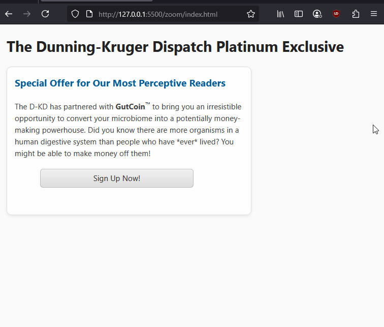

For users with [low vision](https://w3c.github.io/low-vision-a11y-tf/requirements.html#overview-of-low-vision), the ability to zoom or resize text is essential for readability. Users should be able to resize text - using `Cmd +` on MacOS, or `Ctrl +` on Windows - **up to 200%** without loss of content or functionality.

<table-of-contents selector="h2, h3, h4, h5" summary="Overview"></table-of-contents>

## Viewport configuration

The viewport is the visible area of the web page within the browser's window. The `<meta name="viewport">` tag controls how your page scales and responds on different screen sizes.

To support both zooming and responsive layouts make sure to have `width=device-width, initial-scale=1` in your viewport meta tag. FastHTML sets these [by default in core.py](https://github.com/AnswerDotAI/fasthtml/blob/acb190bbe4c3661850de637b4c17bfc2f7ff14b3/fasthtml/core.py#L455) and includes [`viewport-fit=cover`](https://www.w3.org/TR/css-round-display-1/#valdef-viewport-fit-cover), which renders content behind [the notch on mobile devices like iPhones](https://webkit.org/blog/7929/designing-websites-for-iphone-x/).

```python
# https://github.com/AnswerDotAI/fasthtml/blob/acb190bbe4c3661850de637b4c17bfc2f7ff14b3/fasthtml/core.py#L455
viewport = Meta(name="viewport", content="width=device-width, initial-scale=1, viewport-fit=cover")
```

* `width=device-width`: sets the layout viewport width to match the physical screen width.  
* `initial-scale=1`: sets the initial zoom level when the page first loads.  

## Don't prevent user scaling

Avoid using `user-scalable=0`, `user-scalable=no`, or `maximum-scale=1`.  

Blocking zoom directly harms people who rely on it to read or interact with your content. Users with low vision may be unable to enlarge text to a comfortable size forcing them to leave your site entirely.

## Designing for zoom and resizing

Responsive layouts are key to supporting zoom. CSS frameworks like Pico CSS (commonly used with FastHTML) adapt well when paired with:

* Relative units (rem, em, %) instead of fixed pixels.  
* Flexible containers that grow or wrap as content scales.  
* Avoidance of fixed heights/widths that cause clipping.  

Here is an example of fixed widths preventing proper resizing on zoomed to 200% in Firefox.



## WCAG Success Criteria

This WCAG success criterion relates to the accessibility topics covered in this post.

**[1.4.4 Resize Text (AA)](https://www.w3.org/WAI/WCAG22/Understanding/resize-text.html):**  - People should be able to resize page text up to 200% without losing content or functionality. They should be able to do this without requiring additional assistive technologies.