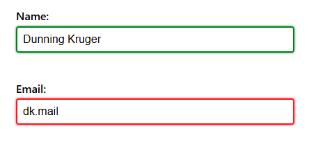
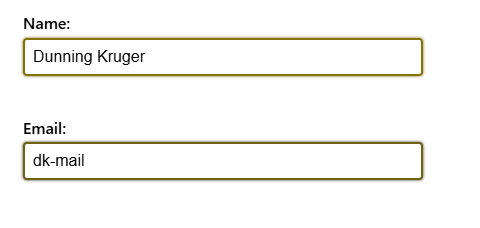
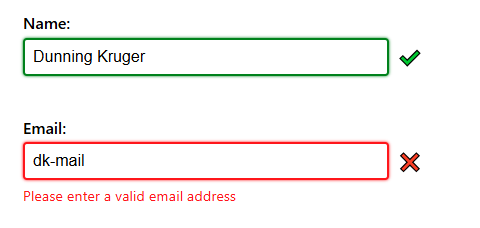
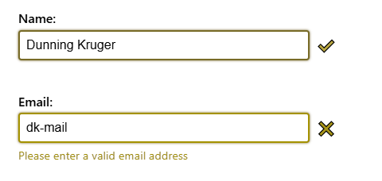
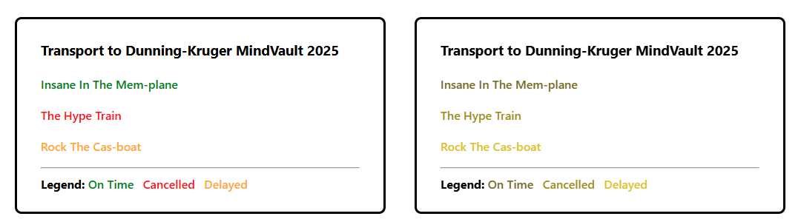
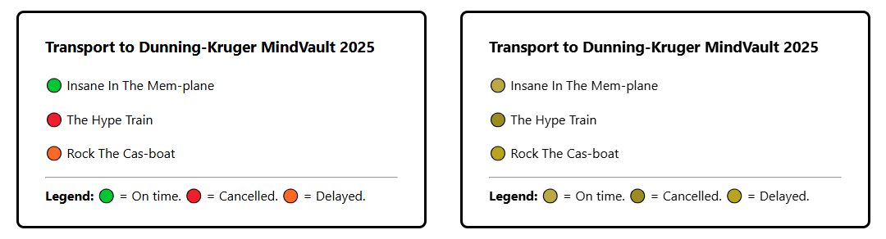
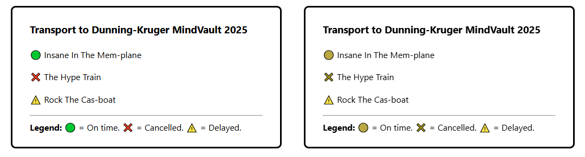
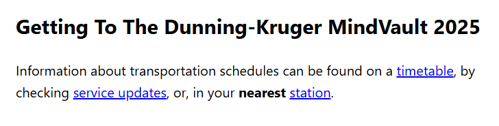
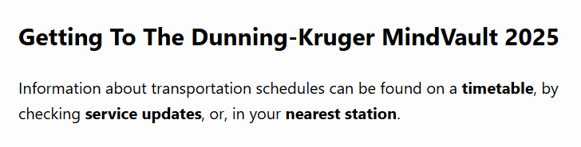

Colour is a powerful design tool. It can be used to draw attention, express meaning, and create hierarchy. It is important to be aware that not everybody perceives colours in the same way. According to [Colour Blind Awareness](https://www.colourblindawareness.org/colour-blindness/types-of-colour-blindness/):

* Approximately 8% of men (1 in 12) and 0.5% of women (1 in 200) are "colour blind", meaning they have difficulty perceiving or distinguishing between certain colours. 
* The most common types are *protanopia* (reduced red perception) and *deuteranopia* (reduced green perception).
* A very small number of people have *achromatopsia* (complete colour blindness).
* Colour vision loss is not always genetic trait, it can develop due [illness, accidents and ageing](https://www.colourblindawareness.org/colour-blindness/causes-of-colour-blindness/acquired-colour-vision-defects/).

These examples highlight why relying solely on colour is not acceptable and why avoiding colour dependence is a baseline (Level A) requirement for web accessibility.

<table-of-contents selector="h2, h3, h4, h5" summary="Overview"></table-of-contents>

## Colours indicating states

One of the most common examples of relying on colour is **form validation**.

The design of forms, validation, and feedback in accessible ways is a detailed topic and will be covered in a future post. 

Within the context of colour use, it is very common for red to indicate an error or invalid input, while green indicates valid data or successful action. 

### Form validation with colours only

In the example below, the "Name" field is valid, and the "Email" field is invalid as it is not a proper email address.



Here are the same fields with *protanopia*. Notice how difficult the colours are to distinguish:



### Form validation with additional text and icon

The example has been updated with icons and error feedback to avoid the reliance on colours.



And with *deuteranopia*:



### System status in user interfaces

Another common uses of red and green: 

* **Hardware**: monitoring software indicates computing / networking resources are "offline" with device's name in red and "online" in green.
* **Transportation**: timetables using green for "on time" and red for "delay" or "cancelled".
* **Build systems**: test names in green if they pass and red if they fail.
* **Chat software**: a circle icon where "active" is green and "busy" is red.

All of these examples would benefit from including icons and/or text to reduce reliance on colour alone. For more compact or minimalist interfaces, consider using different icon shapes (such as circles, squares, or triangles) to distinguish between states.

In the following sections, the left side of each image is a "full colour" version of a fake transport timetable, and the right side is the same timetable with colour vision loss rendering applied to it.

#### Example 1: colour-coded text only

As you can see in this example, not only is the difference between the statuses difficult to distinguish but the text itself is difficult to read because it falls below the [required 4.5:1 ratio](low-contrast-text.md#the-text-contrast-requirements).



#### Example 2: colour-coded icons

It's common for user interfaces to use uniform shapes or icons for the sake of simplicity (coding and styling), often when elements or components are generated programmatically from data. As the example below demonstrates, the colour coding of the icons alone is not enough to distinguish between the statuses. In fact, the uniformity almost makes it harder than the previous colour-coded text example.



#### Example 3: distinctive icons

By adding distinctive shapes and symbols alongside colour, each status is now easily identifiable even with colour vision loss.



## Links without underlines

Blue underlined links are a **long-standing web convention**, born out of the necessity to [differentiate links from text on terminal UIs](https://blog.mozilla.org/en/internet-culture/deep-dives/why-are-hyperlinks-blue/). They are easily recognisable and remain one of the most effective visual cues for identifying links in bodies of text.



Some modern designs and CSS frameworks remove these default styles for "cleaner" or “minimalist” appearance. Frameworks such as Tailwind CSS reset [many element styles](https://github.com/tailwindlabs/tailwindcss/blob/main/packages/tailwindcss/preflight.css) to provide a fresh slate to start from, leaving it up to developers to reintroduce styles and functionality via utility CSS classes. For links this often means resetting the text `color` and [`text-decoration`](https://developer.mozilla.org/en-US/docs/Web/CSS/text-decoration) properties:

```css
a {
  ...
  color: inherit;
  text-decoration: inherit;
  ...
}
```

Without underlines and colour, links become visually indistinguishable from surrounding text, forcing people to search word-by-word or, if they are able to use a mouse, rely on the cursor changing to the [`pointer` icon](https://www.w3schools.com/cssref/playit.php?filename=playcss_cursor&preval=pointer) to find what's clickable.



### Links do not have to be blue

It's fine to change the `color` property as long as it meets the **4.5:1 text contrast ratio**. See this previous post detailing ways to resolve [low contrast text issues](low-contrast-text.md#resolving-contrast-issues).

Be aware that non-standard colours may still confuse people used to the conventional styling. In 2016, [Google briefly experimented with changing links to black](https://mashable.com/article/google-black-links), which left people [confused and annoyed](https://www.nbcnews.com/tech/tech-news/google-tests-black-links-people-see-red-n572171). Google later responded: *"We're not quite sure that black is the new blue"*.

### When underlines can be removed

Underlines *can* be removed in **clearly defined** UI components, e.g. navigation bars, where the link text is on its own and it is visually obvious that it's interactive. In bodies of text, however, underlines should not be removed.

## Charts, graphs, and visual data

Reliance on colour should also be avoided in visual representations of data. Augment the use of colour with additional supporting information:

* **Label data directly** instead of relying on colour-coded keys or legends.
* **Include a legend** with clear, descriptive labels when multiple data types or categories are shown.
* **Use patterns or textures (stripes, dots, shapes)** in combination with colours to differentiate sections, segments or bars.
* **Provide a data table alternative** so the same information can be read by screen readers.

For more practical guidance for creating accessible presentations of complex data sets please see [Data Visualization Accessibility](https://www.mass.gov/info-details/data-visualization-accessibility).

## Referencing colours in text

Avoid using colours alone in instructions or descriptions. Aside from causing issues for people with colour vision loss, assistive technologies like screen readers have no ability to help blind users understand colours. Use names, labels, or positions instead:

* Instead of "Click the green button", use "Click the Accept button".  
* Replace phrases like "Refer to the blue section" with "Refer to the Sales section of the chart".
* "Completed tasks will appear under the "Done" heading" is better than "Completed tasks will appear in green".  
* Swap statements like "All fields highlighted in red are required" for "Check the fields marked as required".

## Emulating colour related vision issues

A useful question to ask is: *"If I removed ALL colour from this page or component, would someone still understand what to do or where to click?"*. 

It can be difficult to appreciate the impact of colour vision loss without experiencing it directly, but there are tools to help provide some degree of understanding.

### Testing individual colour combinations

[Whocanuse.com](https://www.whocanuse.com/) helps you see how different text and background colour combinations appear to people with many types of colour vision loss (and other visual impairments), while also showing their contrast ratios.

### Browser-based emulation tools

Most Chromium browsers - e.g. Chrome, Edge, Brave - provide a very useful way to emulate the common colour vision issues in their Developer Tools. 

With DevTools open:

1. Open the Command Palette via `Ctrl + Shift + P` (Windows) or `Cmd + Shift + P` (MacOS).
2. Type "Rendering".
3. Press Enter or click on "Show Rendering".
4. On on the "Rendering" panel scroll down to find the dropdown list titled "Emulate vision deficiencies". 
5. Click an item in list - Protanopia, Deuteranopia, Tritanopia or, Achromatopsia - to change the rendering of the current web page.

**Be aware that once the DevTools are closed the emulated vision deficiency will be stopped too.**


## WCAG Success Criteria

These WCAG success criteria relate to the accessibility topics covered in this post.

**[1.4.1 Use of Color (Level A)](https://www.w3.org/WAI/WCAG22/Understanding/use-of-color.html)** - Colour should not be relied on as the only way to communicate information. This applies to text, icons, buttons, charts, links, and all interface elements.

**[1.4.11 Non-text Contrast (Level AA)](https://www.w3.org/WAI/WCAG21/Understanding/non-text-contrast.html)** - User interface components and graphical objects (e.g., charts, diagrams, icons) must have a contrast of at least 3:1 with nearby colours so they are easy to see and use.