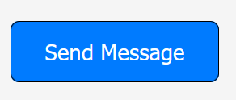
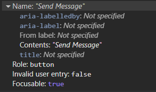
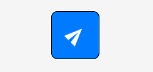
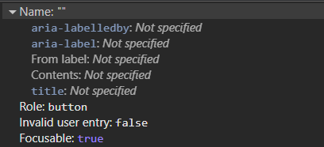
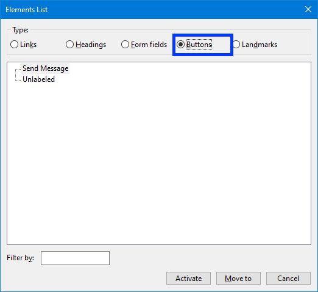
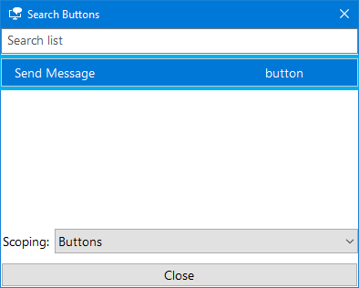
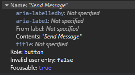
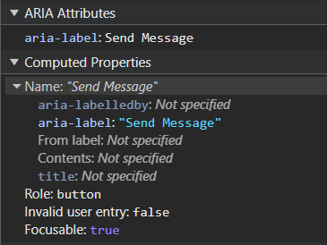
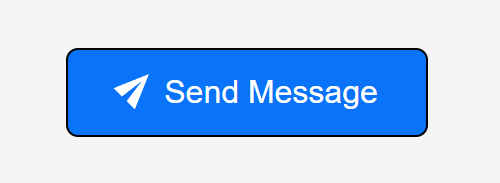

**The code to accompany this post is "[Empty Buttons](https://github.com/anthonycosgrave/fasthtml-web-a11y/tree/main/empty_buttons)". Screen reader required!**.

Like [empty links](../fasthtml-web-a11y/empty-links.md), empty buttons lack an "accessible name" (accName). They are commonly the result of using images or icons - often referred to as "icon buttons" - to communicate the button's purpose to sighted users without providing an alternative for assitive technology (AT) users. If the user does not know what a button does, they are unlikely to want to interact with it.

According to the Web AIM Millions project, empty buttons have been in the **Top 6 accessibility issues since 2019**, with [29.6% of homepages](https://webaim.org/projects/million/#wcag) having at least one empty button in 2025.

<table-of-contents selector="h2, h3, h4, h5" summary="Overview"></table-of-contents>

## A standard button with text example

A standard button with visible text uses that text as its accName. 
```python
Button('Send Message')
```



This is exposed in the browser's accessibility tree. It is clear to both sighted users and AT users what the result of interacting with the button will be.



## An empty button example

This button uses an image to convey its purpose.

```python
Button(Img(src='/bootstrap/icons/send.svg'))
```



But no accName is exposed in the accessibility tree. A `role` is available because `<button>` is a native HTML element and that accessible information is provided automatically.



## How they appear to a screen reader user

The differences between the buttons becomes clearer when announced by screen readers.

### Firefox and NVDA 

NVDA announces the text button using its accName, *"Send Message button"*, while the empty button is announced simply as *"button"*.

<lite-youtube videoid="YUSY5VHMjRM" title="Empty Button Example With Firefox and NVDA" style="background-image: url('https://i.ytimg.com/vi/YUSY5VHMjRM/hqdefault.jpg');">
  <a href="https://youtu.be/YUSY5VHMjRM" class="lyt-playbtn" title="Play Video">
    <span class="lyt-visually-hidden">Play Video: Empty Button Example With Firefox and NVDA</span>
  </a>
</lite-youtube>

Here is how the buttons present themselves in NVDA's Elements list via `NVDA Key + F7`, `Alt + B`:

  


### Edge and Narrator

Windows Narrator is the same, the first button is announced as *"Send Message button"* while the second one is only *"button"*.

<lite-youtube videoid="F_KhKsFq-r4" title="Empty Button Example with Edge and Windows Narrator" style="background-image: url('https://i.ytimg.com/vi/F_KhKsFq-r4/hqdefault.jpg');">
  <a href="https://youtu.be/F_KhKsFq-r4" class="lyt-playbtn" title="Play Video">
    <span class="lyt-visually-hidden">Play Video: Empty Button Example with Edge and Windows Narrator</span>
  </a>
</lite-youtube>

And only the labelled button appears in Narrator's Element list via `Insert + F7`:

  

## How to fix empty buttons by providing an accessible name

The [Accessible Name and Description Algorithm](https://www.w3.org/TR/accname-1.1/) is used to determine an element's accName. The list of properties used by the algorithm is visible in most browser's DevTools in the "Accessibility" panel in the "Name" section. 

  

In the spirit of the [first rule of ARIA](https://www.w3.org/TR/using-aria/#rule1) - use native HTML and attributes before turning to ARIA - these solutions will follow a similar approach.

### An accessible button with NVDA

<lite-youtube videoid="6UBBa8G93bQ" title="Accessible Button with Image Example with NVDA" style="background-image: url('https://i.ytimg.com/vi/6UBBa8G93bQ/hqdefault.jpg');">
  <a href="https://youtu.be/6UBBa8G93bQ" class="lyt-playbtn" title="Play Video">
    <span class="lyt-visually-hidden">Play Video: Accessible Button with Image Example with NVDA</span>
  </a>
</lite-youtube>

### An accessible button with Narrator

<lite-youtube videoid="2SpiJoM9neo" title="Accessible Button with Image Example with Narrator" style="background-image: url('https://i.ytimg.com/vi/2SpiJoM9neo/hqdefault.jpg');">
  <a href="https://youtu.be/2SpiJoM9neo" class="lyt-playbtn" title="Play Video">
    <span class="lyt-visually-hidden">Play Video: Accessible Button with Image Example with Narrator</span>
  </a>
</lite-youtube>


### Option 1 - Use the `` `alt` text attribute 

Technically, the [`alt`](http://developer.mozilla.org/en-US/docs/Web/API/HTMLImageElement/alt) text is intended as an **alternate text description** of an image for the accessibility tree. With icon buttons the `alt` attribute is an acceptable way to provide an accName that tells an AT user what the purpose of the button is.

```python
Button(Img(src='/bootstrap/icons/send.svg', alt='Send Message'))
```

The button now has an accName that will be in the accessibility tree, and is viewable in browser DevTools. 


#### `alt` text tips 

Buttons should be used for **triggering actions**, tell the user what will happen if they activate the button.
 
1. Use short, functional terms e.g. "Delete", "Edit", or "Send Message".  
2. Don't mention actions like "click", "tap" or "press".  
3. Don't include the element e.g. "Delete" not "Delete Button"

### Option 2 - Use 'visually hidden' text  

Also known as 'sr-only' or 'screen reader only' in other CSS libraries like older versions of Bootstrap and the current version of [Tailwind](https://tailwindcss.com/docs/display#screen-reader-only) it is a way to hide text while still making it accessible to AT.

As mentioned in the ["Intro to the Accessibility Tree" post](../fasthtml-web-a11y/intro-accessibility-tree.md), elements that are hidden from the DOM do not become part of the accessibility tree. In this case, the content is made invisible to sighted users while keeping it in the DOM and therefore available to the accessibility tree.

For a thoroughly detailed breakdown of the technique please read [Scott O'Hara's "Inclusively Hidden"](https://www.scottohara.me/blog/2017/04/14/inclusively-hidden.html) post. It can be used to hide a lot of other content, not just button related text, in an accessible way.

```css
.visually-hidden {
    clip: rect(0 0 0 0);
    clip-path: inset(50%);
    height: 1px;
    overflow: hidden;
    position: absolute;
    white-space: nowrap;
    width: 1px;
}
```

To prevent screen readers from a "double announcement" of **both** the `alt` text and the visually hidden text, set `alt` to an **empty string**.

```python
Button(
    Img(
      src='/bootstrap/icons/send.svg', 
      alt=''
    ), 
    Span(
        'Send Message', 
        cls='visually-hidden'
      )
    )
```

And now button's accName will be derived from it's "Contents" as shown in the screenshot below.



### Option 3 - Use `aria-label` on the `<button>`

`aria-label` adds a *programmatic* label (it exists in code but not visually) to the button.

```python
Button(
  Img(
    src='/bootstrap/icons/send.svg', 
    alt=''
    ), 
    aria_label='Send Message'
  )
```

The accName will come now from the `aria-label` text. The tips mentioned above for writing `alt` text also apply for aria-labels in this instance.



**Note:** There are known issues with the translation of text in `aria-label`. For a detailed explanation see [Adrian Roselli's "aria-label Does Not Translate"](https://adrianroselli.com/2019/11/aria-label-does-not-translate.html#Update06).

## When using inline `<svg>`

There are many benefits to using inline `<svg>` such they are exposed to CSS styling (e.g. theme based colour changes using 'currentColor') and JavaScript interaction (e.g. animation). There are some additional steps required when using them with buttons.

### Option 1 - Use 'visually hidden' text

1. Add the `<span>` with the text you want to visually hide.  
2. Add `role="img"` to the `<svg>` to ensure AT treats it as one image and not as a group of graphic elements.   
3. Add `aria-hidden="true"` to hide the `<svg>` from screen readers to prevent any potential double announcements.  
4. Add `focusable="false"` to prevent issues with some versions of browsers where users could confusingly TAB to the SVG itself inside the button.  

```python
Button(
    Span('Send Message', cls='visually-hidden'),
    Svg(
        Path(d='M15.854.146a.5.5 0 0 1 .11.54l-5.819 14.547a.75.75 0 0 1-1.329.124l-3.178-4.995L.643 7.184a.75.75 0 0 1 .124-1.33L15.314.037a.5.5 0 0 1 .54.11ZM6.636 10.07l2.761 4.338L14.13 2.576zm6.787-8.201L1.591 6.602l4.339 2.76z'),
        xmlns='http://www.w3.org/2000/svg',
        width='16',
        height='16',
        fill='currentColor',
        viewbox='0 0 16 16',
        cls='bi bi-send',
        role='img',
        aria_hidden='true',
        focusable='false'
    )
)
```

### Option 2 - Use `aria-label`

1. Add an `aria-label` to the `<button>` with the text you to use for the accName.  
2. Add `role="img"` to the `<svg>` to ensure AT treats it as one image and not as a group of graphic elements.    
3. Add `aria-hidden="true"` to the `<svg>` to hide it from screen readers and prevent any potential double announcements.  
4. Add `focusable="false"` to prevent issues with some versions of browsers where users could confusingly TAB to the SVG itself inside the button. 

```python
Button(
    Svg(
        Path(d='M15.854.146a.5.5 0 0 1 .11.54l-5.819 14.547a.75.75 0 0 1-1.329.124l-3.178-4.995L.643 7.184a.75.75 0 0 1 .124-1.33L15.314.037a.5.5 0 0 1 .54.11ZM6.636 10.07l2.761 4.338L14.13 2.576zm6.787-8.201L1.591 6.602l4.339 2.76z'),
        xmlns='http://www.w3.org/2000/svg',
        width='16',
        height='16',
        fill='currentColor',
        viewbox='0 0 16 16',
        cls='bi bi-send',
        role='img',
        aria_hidden='true',
        focusable='false'
    ),
    aria_label='Send Message'
)
```

## A More Inclusive Option - Image and Text 

A more robust and overall inclusive approach would be to include **both** the image and the text in the button. As shown in the very first example, the button's accName will be derived from the text and the icon will be hidden from AT. However, there are valid reasons for not doing this such as a preferred design aesthetic or simply a lack of screen space.

  

**Note:** Additional CSS is often needed to align icons and text, especially for spacing and vertical alignment. Styling details will vary depending on your chosen images and CSS framework.

### For ``

1. Set the `alt=''` as the icon is now considered "decorative" i.e. providing no useful information requiring an alternate description.  
2. Add `aria-hidden='true'` to make sure it is ignored by screen readers.  

```python
Button(
    Img(
      src='/bootstrap/icons/send.svg', 
      alt='', 
      aria_hidden='true'
    ), 
    'Send Message',
  )
```

### For inline `<svg>`

1. Add `aria-hidden='true'` to hide the SVG from screen readers.  
2. Add `focusable='false'` to prevent the user from TAB-ing to the SVG itself.  

```python
Button(
    Svg(
        Path(d='M15.854.146a.5.5 0 0 1 .11.54l-5.819 14.547a.75.75 0 0 1-1.329.124l-3.178-4.995L.643 7.184a.75.75 0 0 1 .124-1.33L15.314.037a.5.5 0 0 1 .54.11ZM6.636 10.07l2.761 4.338L14.13 2.576zm6.787-8.201L1.591 6.602l4.339 2.76z'),
        xmlns='http://www.w3.org/2000/svg',
        width='16',
        height='16',
        fill='currentColor',
        viewbox='0 0 16 16',
        cls='bi bi-send',
        aria_hidden='true',
        focusable='false'
    ),
    'Send Message'
)
```

## WCAG Success Criteria

These WCAG success criteria relate to the accessibility topics covered in this post.

**[1.1.1 Non-text Content (Level A)](https://www.w3.org/WAI/WCAG21/Understanding/non-text-content.html)** - Any content that isn't text, such as images, icons, or buttons, must have a text alternative so assistive technologies can understand its purpose. 

**[4.1.2 Name, Role, Value (Level A)](https://www.w3.org/WAI/WCAG21/Understanding/name-role-value.html)** - Every interactive element must have a name and role that assistive technologies can detect via the accessibility tree.