**The code to accompany this post is "[Empty Links](https://github.com/anthonycosgrave/fasthtml-web-a11y/tree/main/empty_links)". Screen reader required!**

Since 2019, empty links rank as **one of the most common accessibility issues**. According to the 2025 WebAIM Millions Project [45.4% of homepages](https://webaim.org/projects/million/#wcag) contained empty links.

<table-of-contents selector="h2, h3, h4, h5" summary="Overview"></table-of-contents>

## What is an empty link?

An empty link is a link with no **accessible name** (accName), meaning assistive technology (AT) users have no way to know what the link does. This often happens when visible link text is replaced with an icon or image - e.g. a shopping cart icon replaces “View cart”, or a social media logo replaces the text of a company name - without providing a text alternative for AT.

### A standard text-based link example

A typical text-based link exposes that text as its accName. Additionally, links are styled by default - typically underlined and coloured - to make it visually clear that it's a link.

```python
A('My GitHub Profile', href='https://github.com/your-username')
```

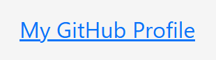

And this can be seen in the "Accessibility" panel in browser DevTools.

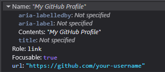  

#### Writing accessible link text

Only using text for links does not automatically make them accessible. The text should be clear and descriptive for everyone and, where possible, make sense when read or heard out of context. In general:

* Don't be vague: avoid “Click here”, “Read more”, or “Download” that give no context when read out of place.
* Be **specific**: “Read more about Physical Reservoir Computing” is better than “Read more”.
* Keep it **simple**: avoid *unnecessary* jargon or complex wording.
* Avoid redundant phrasing like “Click here to” or “link to”. For example, instead of “Click here to download”, use “Download the 2025 Budget Breakdown (PDF)”.

Clear, descriptive link text improves both accessibility and usability.

### An empty link example

The text has been replaced with image to display a Github logo.

```python
A(Img(src='images/logos/github.svg'), href='https://github.com/your-username')
```

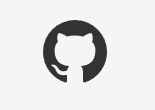

A sighted user may recognise the image and understand the purpose of the link but as the screenshot below shows, nothing meaningful is exposed to AT apart from its `role`. As it's a native HTML element the `role` is provided **automatically**.

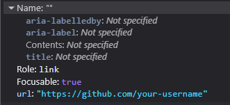  

## How they appear to a screen reader user

The differences between a standard text link and an empty link becomes clearer when announced by screen readers.

### Firefox and NVDA

The text link is announced as *“My GitHub Profile link”* which is clear and meaningful.

The empty link is announced as *“your username graphic link”* NVDA is using **the URL path** as the name, which gives no indication of purpose. In many real cases, that path could be long and/or unreadable - UUIDS, query strings etc. - making the user experience even worse.

<lite-youtube videoid="XQovIURDfug" title="Empty Link Example with Firefox and NVDA" style="background-image: url('https://i.ytimg.com/vi/XQovIURDfug/hqdefault.jpg');">
  <a href="https://youtu.be/XQovIURDfug" class="lyt-playbtn" title="Play Video">
    <span class="lyt-visually-hidden">Play Video: Empty Link Example with Firefox and NVDA</span>
  </a>
</lite-youtube>

Here is how the links appear in NVDA's "Elements" list via the keyboard command `Insert + F7`:

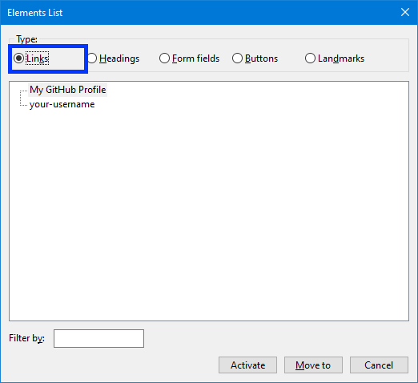  

### Edge and Windows Narrator

**Note:** Microsoft Edge is built on Chromium (like Google Chrome), so this example also illustrates how other Chromium-based browsers typically handle empty links with screen readers.

The text link is announced simply as *“Link, My GitHub Profile”* which is clear and understandable.

The empty link is announced as *“Link, to get missing image descriptions open the context menu”* and then Narrator continues by reading out the entire URL. This gives the user no meaningful indication of the link's purpose and adds unnecessary noise.

<lite-youtube videoid="RpW3v3RjZBY" title="Empty Link Example with Edge and Windows Narrator" style="background-image: url('https://i.ytimg.com/vi/RpW3v3RjZBY/hqdefault.jpg');">
  <a href="https://youtu.be/RpW3v3RjZBY" class="lyt-playbtn" title="Play Video">
    <span class="lyt-visually-hidden">Play Video: Empty Link Example with Edge and Windows Narrator</span>
  </a>
</lite-youtube>

And in Narrator's "Elements" List via `Insert + F7`:

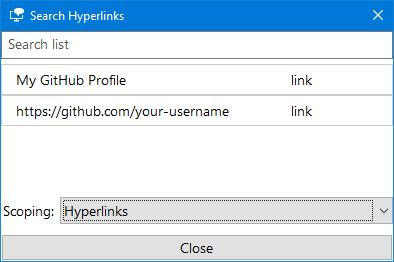  

### Browser attempts to "fix" missing content

As shown in the Edge and Narrator example above, certain browsers can identify an issue and attempt to resolve it. Both [Edge](https://support.microsoft.com/en-us/microsoft-edge/accessibility-features-in-microsoft-edge-4c696192-338e-9465-b2cd-bd9b698ad19a#bkmk_get_image_descriptions) and [Chrome](https://support.google.com/chrome/answer/9311597?hl=en) offer the option to search via Google or Bing to find information about the image being used for the link. In practice, this behaviour is unreliable (failing more than it succeeds in my experience) and happens even when the related accessibility settings have been **turned off** in both browsers

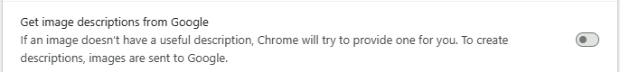  

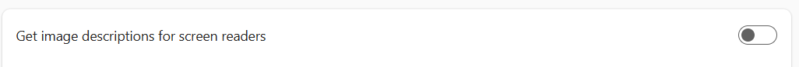 

## Fix empty links by providing an accessible name

As mentioned at the start, an empty link does not provide an accName for the accessibility tree which in turns means there is nothing useful available to the AT. The [Accessible Name and Description Algorithm](https://www.w3.org/TR/accname-1.1/) is used determine what the accName of an element should be. The list of properties used by the algorithm is visible in most browser's DevTools in the "Accessibility" panel in the "Name" section.

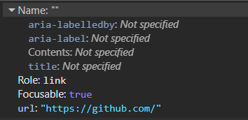  

In the spirit of the [first rule of ARIA](https://www.w3.org/TR/using-aria/#rule1) - use native HTML and attributes before turning to ARIA - these solutions will follow a similar approach.

The guidelines given at the start about [writing accessible link text](#writing-accessible-link-text), in general, apply for the fixes that will be discussed below.

Before we look at the different ways to fix empty links, here's what a properly accessible link sounds like with a screen reader.

### An accessible link with Firefox and NVDA

<lite-youtube videoid="ip4RBzI9OoQ" title="Accessible Link With Image Example - Firefox and NVDA" style="background-image: url('https://i.ytimg.com/vi/ip4RBzI9OoQ/hqdefault.jpg');">
  <a href="https://youtu.be/ip4RBzI9OoQ" class="lyt-playbtn" title="Play Video">
    <span class="lyt-visually-hidden">Play Video: Accessible Link With Image Example - Firefox and NVDA</span>
  </a>
</lite-youtube>

### An accessible link Narrator and Edge

**Note:** **Microsoft Edge is a Chromium-based browser (like Google Chrome), so this example also reflects how properly named links can work in other Chromium browsers.**

<lite-youtube videoid="FR3vsNiYcks" title="Accessible Link With Image Example - Narrator and Edge" style="background-image: url('https://i.ytimg.com/vi/FR3vsNiYcks/hqdefault.jpg');">
  <a href="https://youtu.be/FR3vsNiYcks" class="lyt-playbtn" title="Play Video">
    <span class="lyt-visually-hidden">Play Video: Accessible Link With Image Example - Narrator and Edge</span>
  </a>
</lite-youtube>

### Option 1 Use the `` `alt` text attribute

Technically, the [`alt`](http://developer.mozilla.org/en-US/docs/Web/API/HTMLImageElement/alt) text is intended as an **alternate text description** of an image for the accessibility tree. However, when an image replaces link text it is considered a **functional image** and the `alt` attribute can be used to tell an AT user **what the link will do** instead of describing the image.

```python
A(
  Img(
      src='images/bootstrap/github.svg', 
      alt='Visit my GitHub profile'
    ), 
    href='https://github.com/your-username'
)
```

The `alt` attribute provides the accName for the empty link:

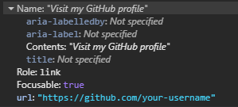  

#### `alt` text tips for functional images

Tell the user **where** they'll go or **what** will happen not how to interact or what the element is.

1. Describe the *purpose* of the link.  
2. Be brief and unique, avoid generic phrases like 'Read More' or 'Download Here'. 
3. Don't use actions like 'click', 'tap' or 'press'.  
4. Don't reference the elements like 'link' or 'image'.

### Option 2 - Use 'visually hidden' text  

Also known as 'sr-only' or 'screen reader only' in other CSS libraries like older versions of Bootstrap and the current version of [Tailwind](https://tailwindcss.com/docs/display#screen-reader-only) it is a way to hide text while still making it accessible to AT.

As mentioned in the ["Intro to the Accessibility Tree" post](../fasthtml-web-a11y/intro-accessibility-tree.md#the-accessibility-tree), elements that are hidden from the DOM do not become part of the accessibility tree. In this case, the content is made invisible to sighted users while keeping it in the DOM and therefore available to the accessibility tree.

For a thoroughly detailed breakdown of the technique please read [Scott O'Hara's "Inclusively Hidden"](https://www.scottohara.me/blog/2017/04/14/inclusively-hidden.html) post. It can be used to hide a lot of other content in an accessible way.

```css
.visually-hidden {
    clip: rect(0 0 0 0);
    clip-path: inset(50%);
    height: 1px;
    overflow: hidden;
    position: absolute;
    white-space: nowrap;
    width: 1px;
}
```

To prevent screen readers from a "double announcement" of **both** i.e. the `alt` text AND the visually hidden text, set `alt` to an **empty string**.

```python
A(
    Img(src='images/bootstrap/github.svg', alt=''),
    Span('Vist my GitHub profile', cls='visually-hidden'),
    href='https://github.com/your-username'
)
```
The accName is now provided by the text content of the `Span()`.

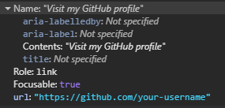  

This approach works well across AT and browsers and is easy to localise if needed.

### Option 3 - Use `aria-label` on the link

`aria-label` adds a *programmatic* label (i.e. it exists in code but not visually) to elements and works well for **short** amounts of text.

```python
A(
    Img(src='images/bootstrap/github.svg', alt=''), 
    href='https://github.com/your-username', 
    aria_label='Visit My GitHub profile'
)
```

The accName will come now from the `aria-label` text. Some screen readers will announce the `<a>` as a "link" when announcing the text therefore to avoid confusing repetition - e.g. "Link go to github.com link" or "Go to github.com link link" - don't include "Link" in the `aria-label` text.

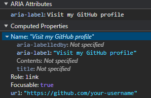  

**Note:** There are known issues with the translation of text in `aria-label`. For a detailed explanation see [Adrian Roselli's "aria-label Does Not Translate"](https://adrianroselli.com/2019/11/aria-label-does-not-translate.html#Update06).

### When using inline `<svg>` images

There are many benefits to using inline `<svg>` such as they are exposed to CSS styling (e.g. theme based colour changes using 'currentColor') and JavaScript interaction (e.g. animation). The overall result is the same as using `` but there are more steps in the process of making them accessible.

#### Option 1 - Use 'visually hidden' text

1. Add the `<span>` with the text you want to visually hide.
2. Add `role="img"` to the `<svg>` to ensure AT treats it as one image and not as a group of graphic elements.    
3. Add `aria-hidden="true"` to hide the `<svg>` from screen readers to prevent any potential double announcements.  
4. Add `focusable="false"` to prevent issues with some versions of browsers where users could confusingly TAB to the SVG itself.  

```python
A(
  Svg(
      Path(d='M8 0C3.58 0 0 3.58 0 8c0 3.54 2.29 6.53 5.47 7.59.4.07.55-.17.55-.38 0-.19-.01-.82-.01-1.49-2.01.37-2.53-.49-2.69-.94-.09-.23-.48-.94-.82-1.13-.28-.15-.68-.52-.01-.53.63-.01 1.08.58 1.23.82.72 1.21 1.87.87 2.33.66.07-.52.28-.87.51-1.07-1.78-.2-3.64-.89-3.64-3.95 0-.87.31-1.59.82-2.15-.08-.2-.36-1.02.08-2.12 0 0 .67-.21 2.2.82.64-.18 1.32-.27 2-.27s1.36.09 2 .27c1.53-1.04 2.2-.82 2.2-.82.44 1.1.16 1.92.08 2.12.51.56.82 1.27.82 2.15 0 3.07-1.87 3.75-3.65 3.95.29.25.54.73.54 1.48 0 1.07-.01 1.93-.01 2.2 0 .21.15.46.55.38A8.01 8.01 0 0 0 16 8c0-4.42-3.58-8-8-8'),
      xmlns='http://www.w3.org/2000/svg',
      width='16',
      height='16',
      fill='currentColor',
      viewbox='0 0 16 16',
      cls='bi bi-github',
      role='img',
      aria_hidden='true',
      focusable='false'
    ),
    Span('Visit my GitHub profile', cls='visually-hidden'),
  href='https://github.com/your-username'
)
```

#### Option 2 - Use `aria-label`

1. Add an `aria-label` to the `<a>` with the text you to expose to AT.
2. Add `role="img"` to the `<svg>` to ensure AT treats it as one image and not as a group of graphic elements.    
3. Add `aria-hidden="true"` to the `<svg>` to hide it from screen readers and prevent any potential double announcements. 
4. Add `focusable="false"` to prevent issues with some versions of browsers where users could confusingly TAB to the SVG itself.  

```python
A(
  Svg(
      Path(d='M8 0C3.58 0 0 3.58 0 8c0 3.54 2.29 6.53 5.47 7.59.4.07.55-.17.55-.38 0-.19-.01-.82-.01-1.49-2.01.37-2.53-.49-2.69-.94-.09-.23-.48-.94-.82-1.13-.28-.15-.68-.52-.01-.53.63-.01 1.08.58 1.23.82.72 1.21 1.87.87 2.33.66.07-.52.28-.87.51-1.07-1.78-.2-3.64-.89-3.64-3.95 0-.87.31-1.59.82-2.15-.08-.2-.36-1.02.08-2.12 0 0 .67-.21 2.2.82.64-.18 1.32-.27 2-.27s1.36.09 2 .27c1.53-1.04 2.2-.82 2.2-.82.44 1.1.16 1.92.08 2.12.51.56.82 1.27.82 2.15 0 3.07-1.87 3.75-3.65 3.95.29.25.54.73.54 1.48 0 1.07-.01 1.93-.01 2.2 0 .21.15.46.55.38A8.01 8.01 0 0 0 16 8c0-4.42-3.58-8-8-8'),
      xmlns='http://www.w3.org/2000/svg',
      width='16',
      height='16',
      fill='currentColor',
      viewbox='0 0 16 16',
      cls='bi bi-github',
      role='img',
      aria_hidden='true'
    ),
  href='https://github.com/your-username',
  aria_label='Visit My GitHub profile'
)
```

## A More Inclusive Option - Image and Text 

While there are legitimate design reasons for not including both, a more inclusive approach is to pair the image or icon with visible link text. The link's accName will come from the text (as seen in the very first example), and the image can be hidden from ATs. This avoids relying on hidden labels and improves clarity for all users.

  

**Note:** Additional CSS is often needed to align icons and text, especially for spacing and vertical alignment. Styling details will vary depending on your chosen images and CSS framework.

### For ``

1. Set the `alt=''` as the icon is now considered "decorative" i.e. providing no useful information requiring an alternate description.  
2. Add `aria-hidden='true'` to make sure it is ignored by screen readers. 

```python
A(
    Img(src='images/bootstrap/github.svg', alt='', aria_hidden='true'),
    'My GitHub profile'
    href='https://github.com/your-username'
)
```

### For inline `<svg>`

1. Add `aria-hidden='true'` to hide the SVG from screen readers.  
2. Add `focusable='false'` to prevent the user from TAB-ing to the SVG itself.  

```python
A(
  Svg(
      Path(d='M8 0C3.58 0 0 3.58 0 8c0 3.54 2.29 6.53 5.47 7.59.4.07.55-.17.55-.38 0-.19-.01-.82-.01-1.49-2.01.37-2.53-.49-2.69-.94-.09-.23-.48-.94-.82-1.13-.28-.15-.68-.52-.01-.53.63-.01 1.08.58 1.23.82.72 1.21 1.87.87 2.33.66.07-.52.28-.87.51-1.07-1.78-.2-3.64-.89-3.64-3.95 0-.87.31-1.59.82-2.15-.08-.2-.36-1.02.08-2.12 0 0 .67-.21 2.2.82.64-.18 1.32-.27 2-.27s1.36.09 2 .27c1.53-1.04 2.2-.82 2.2-.82.44 1.1.16 1.92.08 2.12.51.56.82 1.27.82 2.15 0 3.07-1.87 3.75-3.65 3.95.29.25.54.73.54 1.48 0 1.07-.01 1.93-.01 2.2 0 .21.15.46.55.38A8.01 8.01 0 0 0 16 8c0-4.42-3.58-8-8-8'),
      xmlns='http://www.w3.org/2000/svg',
      width='16',
      height='16',
      fill='currentColor',
      viewbox='0 0 16 16',
      cls='bi bi-github',
      role='img',
      aria_hidden='true'
    ),
  'My GitHub profile',
  href='https://github.com/your-username'
)
```

## Check the framework or library provider's advice

As more frameworks and libraries become serious about their accessiblity many of them will offer guidance on the best ways to use their icons. For example, and to their credit, sites like Bootstrap Icons provide [accessibility advice](https://icons.getbootstrap.com/#accessibility). As with everything, it is important to perform your own testing and verify things work as desired.

## WCAG Success Criteria

These WCAG success criteria relate to the accessibility topics covered in this post.

**[1.1.1 Non-text Content (Level A)](https://www.w3.org/WAI/WCAG21/Understanding/non-text-content.html)** - Any content that isn't text, such as images, icons, or buttons, must have a text alternative so assistive technologies can understand its purpose.

**[2.4.4 Link Purpose (In Context) (Level A)](https://www.w3.org/WAI/WCAG22/Understanding/link-purpose-in-context.html)** - Users should be able to understand what a link does from its text and surrounding context.  

**[2.4.9 Link Purpose (Link Only) (Level AAA)](https://www.w3.org/WAI/WCAG22/Understanding/link-purpose-link-only.html)** - Users should be able to understand what a link does from the link's text alone.

**[4.1.2 Name, Role, Value (Level A)](https://www.w3.org/WAI/WCAG21/Understanding/name-role-value.html)** - Every interactive element must have a name and role that assistive technologies can detect via the accessibility tree.