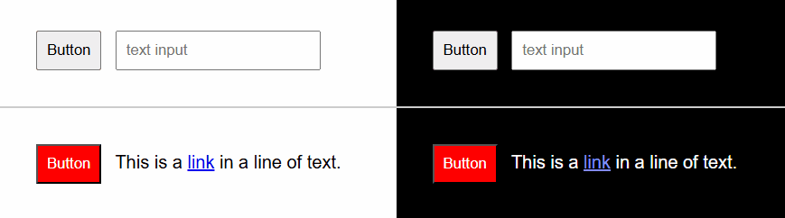
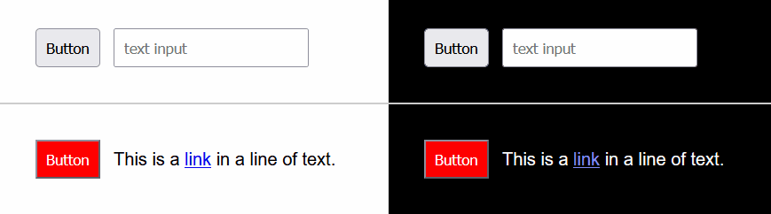
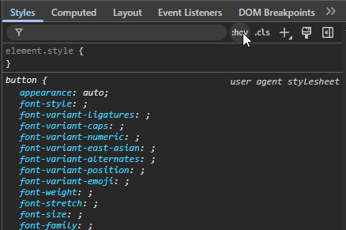
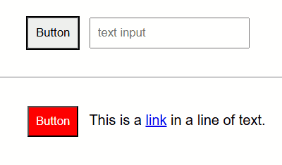
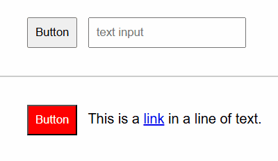
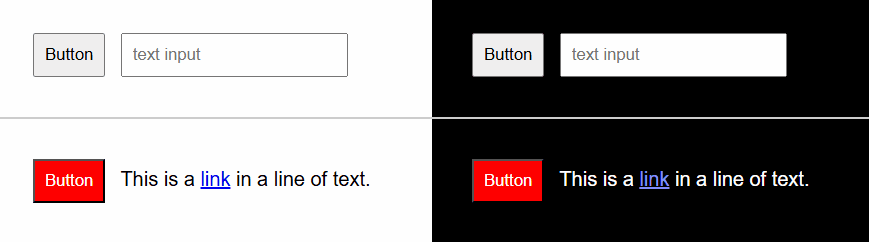
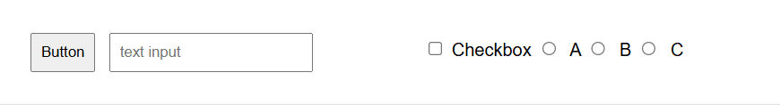
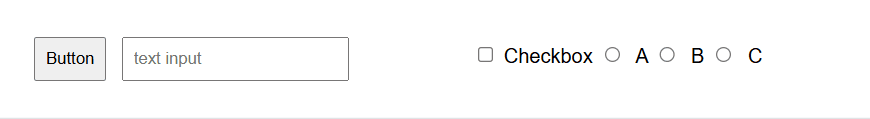

**The code to accompany this post is "[Focus Indicators](https://github.com/anthonycosgrave/fasthtml-web-a11y/tree/main/focus_indicators)"**

A focus indicator shows which element is currently active on the page, such as a link or form field. It helps users who navigate without a mouse (often referred to as "keyboard-only users") know exactly where they are and what element will respond to their input.

<table-of-contents selector="h2, h3, h4, h5" summary="Overview"></table-of-contents>

## Built-in browser focus indicators

Most browsers have a built-in focus indicator, shown as an outline around the element that currently has focus. As you will see in the screen recordings below, the appearance varies across browsers and the indicators can be subtle or hard to see. Safari has its own default focus indicators but I do not currently have access to a Mac to demonstrate them.

**Note** For the purposes of demonstration, all the controls in the below examples are default elements (button, input, and anchor) but they have been slightly enlarged with CSS to be easier to see.

### Chromium-based focus indicator

This screen recording shows the default focus indicator in Chromium browsers such as Chrome and Edge. The default is black outline. Notice how its appearance changes: on the dark background, there is a second outline. There is technically only **one** focus indicator, Chromium adds an extra colour in certain cases to try to make it more visible.




### Firefox focus indicator

Firefox's focus indicator is a blue outline. It also adds a secondary colour when needed, adapting to the background for better visibility.




## :focus-visible for styling keyboard focus

You may remember `:focus-visible` from an earlier post about [skip links](skip-links).

The [`:focus-visible`](https://developer.mozilla.org/en-US/docs/Web/CSS/:focus-visible) pseudo-class allows developers to apply styles **specifically for keyboard focus**. It is [supported across all modern browsers](https://caniuse.com/?search=focus-visible).

In Chrome DevTools for example, you can force the `:focus-visible` state as shown below.




The default styling across the browsers is essentially the same:

```css
/* Chromium browsers */
:focus-visible {
    outline: -webkit-focus-ring-color 1px auto;
}

/* Firefox */
:focus-visible {
    outline: 1px auto;
}
```

In both cases it roughly translates to *"when an element receives keyboard focus, draw a 1-pixel thick outline using the browser's built-in values for focus colour and style."*. Browsers sometimes add a second outline automatically (as you saw in the earlier screen recording examples), but that is done in software by the browser adapting it single default style.

Outlines unlike borders, do not affect element size or layout, preventing the page from shifting in layout or appearing broken.

As you can see from the earlier section, default focus indicators are inconsistent between browsers. They can often clash with a site's design or branding. This is why developers commonly override them to provide a consistent appearance but you should **never remove outlines** via `outline: none` or `outline: 0`. For a more in-depth explanation see [{ outline: none; } DON'T DO IT!](https://www.outlinenone.com/).

## Creating a more accessible focus indicator

While technically WCAG compliant (they show a visible indicator when an element is focused), browser-provided focus indicators are in practice often too subtle or limited to reliably help users. It is important to be aware: **once you override them, it becomes your responsibility to ensure your focus indicators meet WCAG requirements!**

### The WCAG requirements

As part of the Level AA requirements, keyboard focus needs to be a [visible indicator](https://www.w3.org/WAI/WCAG22/Understanding/focus-visible.html) to the user whenever an element receives focus. There is also a colour contrast requirement that states the focus indicator **must have a contrast ratio of *at least* [3:1 against nearby colours](https://www.w3.org/WAI/WCAG22/Understanding/non-text-contrast.html)**.

As of the newer WCAG 2.2, there are **specific** requirements for the [appearance of the focus indicator](https://www.w3.org/WAI/WCAG22/Understanding/focus-appearance.html):
*  **at least a 2px thick perimeter.**  
* **contrast ratio of 3:1 compared to its unfocused state.** 

These additional requirements are at Level AAA, but the additional work is minimal for improved accessibility and usability.

In short, **make the focus indicator large enough and high contrast**.

### Units: `px` vs `rem`

WCAG examples and browser defaults typically use `px` because pixels give a predictable **minimum** thickness. For extra flexibility (so indicators scale when users change default font sizes), consider using [`rem` units](https://developer.mozilla.org/en-US/docs/Web/CSS/length#rem). They are relative to the root `font-size` set on a page's `<html>` element, or if none is specified, most browsers default to `16px`.

For example, to convert `2px` to `rem`: `2px / 'root font size' = 2px / 16px = 0.125rem`. 

**Note: all examples below use `rem` and show the pixel equivalent in comments.**

### Contrast ratio checkers

There are many options available, here are ones I have used regularly:

* Polypane's [Color Contrast](https://colorcontrast.app/) has the **extremely useful** colour suggestions feature when your chosen colours have too low a contrast level for AA or AAA.
* WebAIM's [Contrast Checker](https://webaim.org/resources/contrastchecker) is reliable.
* TGPi's [The Colour Contrast Analyser (CCA)](https://www.tpgi.com/color-contrast-checker/) if you would prefer an **installable** application. 

### Example 1 using `outline`  

This creates a solid [`outline`](https://developer.mozilla.org/en-US/docs/Web/CSS/outline) drawn directly around the element's border. The outline `color` must be checked for sufficient contrast against the element itself and surrounding UI. On heavily styled elements, adding thickness to the outline can sometimes reduce visual appeal or make the element look crowded.

In this simplified example, we need a colour that has a 3:1 contrast ratio against both a white (#fff) background and the red (#f00) of the button.

Black : White is 21:1 and Black : Red is 5.25:1.

```css
:focus-visible {
    outline: 0.125rem solid black; /* 2px */
}
```



### Example 2 enhancing `outline` with `outline-offset`

Adding an [`outline-offset`](https://developer.mozilla.org/en-US/docs/Web/CSS/outline-offset) improves visibility by adding some visual space between the focus indicator and the focused element. This separation makes the focused area larger and easier to perceive. The contrast ratio is measured against the background colour (allowing for other colour options) and avoids clashing with element styles such as borders or shadows.

We will also make increase the size to 0.1875rem (3px) for both the outline and the offset. And for demonstration use `#033c8c` as the outline's `color` ([10:35:1 contrast ratio](https://colorcontrast.app/#fg=%23033c8c&bg=%23fff&level=aaa&format=rgb&algo=WCAG2&filter=none))

```css
:focus-visible {
    outline: 0.1875rem solid #033c8c; /* 3px */
    outline-offset: 0.1875rem;     /* 3px */
}
```



### Two colour indicators with `outline` and `box-shadow`

Single colour focus indicators are very useful and often sufficient, especially on sites with consistent backgrounds and reduced colour palettes. They are simple to implement and meet requirements so long as the chosen colour provides sufficient contrast.

However, on sites with varied backgrounds, a single colour may not always be a reliable choice. Designing separate compliant styles and coherent CSS rules for every possible background would be time consuming. A more reliable option is to use **two highly contrasting colours**, typically one light and one dark. If the colours have a contrast ratio of at least 9:1 - e.g. black (`#000000`) and white (`#ffffff`) at 21:1 - then one is guaranteed to meet the 3:1 contrast requirement against any solid background. This cannot be assumed for backgrounds that contain images or gradients, and they must be thoroughly tested.

In this approach, the inner outline contrasts with the element itself, while the outer box-shadow separates it from the background. Together, they make the focus state more robust and reliably perceptible across a wide range of colour combinations.

#### Example 3 a "universal" focus indicator

[Sara Soueidan's 'universal' focus indicator](https://www.sarasoueidan.com/blog/focus-indicators/#a-%E2%80%98universal%E2%80%99-focus-indicator) is a practical example of the two colour high-contrast approach. As Sara notes, if most of your site's components are dark colours, you may want to flip the order of black and white so the white outline sits against the darker element, creating stronger contrast.

**Note: I would really recommend reading Sara's [post](https://www.sarasoueidan.com/blog/focus-indicators/) in full for a very detailed breakdown of focus indicators**

```css
:focus-visible {
    outline: 0.1875rem solid black;   /* 3px */
    box-shadow: 0 0 0 0.375rem white; /* 6px */
}
```



#### Example 4 the "Oreo" indicator

Inspired by Erik Kroes ['Oreo' inspired focus indicator](https://www.erikkroes.nl/blog/the-universal-focus-state/#introducing-the-oreo-focus) it uses a black [`double`](https://developer.mozilla.org/en-US/docs/Web/CSS/outline-style#double) outline and fills the gap between the outlines with a white `box-shadow`. It looks like an [Oreo cookie](https://www.oreo.com/collections/classics).

```css
:focus-visible {
    outline: 0.375rem double black;  /* 6px */
    box-shadow: 0 0 0 0.25rem white;    /* 4px */
}
```


##### Rounding edges with `border-radius`

Erik Kroes' original “Oreo” focus indicator uses a small `border-radius` of `0.125rem` (CSS example below). You can also combine border-radius with outline-offset (CSS example below) so the indicator follows the shape of the focused element. Rounded edges are often more visually consistent with modern UI, but support may vary on native controls such as [checkbox](https://developer.mozilla.org/en-US/docs/Web/HTML/Reference/Elements/input/checkbox) and [radio buttons](https://developer.mozilla.org/en-US/docs/Web/HTML/Reference/Elements/input/radio). Many CSS frameworks replace these inputs with custom components, which is why the appearance can differ across projects.

Erik Kroes full example:

```css
:focus-visible {
    outline: 0.375rem double black;  /* 6px */
    box-shadow: 0 0 0 0.25rem white; /* 4px */
    border-radius: 0.125rem;    /* 2px */
}
```



The `outline-offset` example with a `border-radius`:

```css
:focus-visible {
    outline: 0.1875rem solid #033c8c;   /* 3px */
    outline-offset: 0.1875rem;       /* 3px */
    border-radius: 0.1875rem;       /* 3px */
}
```



### Non-solid outlines: dashed or dotted indicators

WCAG allows non-solid indicators only if they are **at least as large** as a solid outline would be. Dashed/dotted lines include gaps, so the thickness of the outline must be increased to achieve a comparable visible area. These values may require tweaking depending on how different browsers render dotted or dashed outlines. For example:

```css
:focus-visible { 
    outline: 0.125rem dashed black;  /* 4px */
    outline-offset: 0.125rem;        /* 2px */
}

:focus-visible { 
    outline: 0.3125rem dotted black; /* 5px */
    outline-offset: 0.125rem;        /* 2px */
}
```

## Supporting light and dark schemes

Users can set a preference (at the operating system or browser level) for a preferred light or dark scheme. CSS exposes this preference through the [prefers-color-scheme](https://developer.mozilla.org/en-US/docs/Web/CSS/@media/prefers-color-scheme) media query. If schemes are something you're supporting, it can be as simple as inverting the outline colour between light and dark modes:

```css
@media (prefers-color-scheme: light) {
    :focus-visible { 
        outline: 0.125rem solid black; 
        outline-offset: 0.125rem; 
    }
}
@media (prefers-color-scheme: dark) {
    :focus-visible { 
        outline: 0.125rem solid white; 
        outline-offset: 0.125rem; 
    }
}
```

## Using it in your FastHTML app

### If you are not using Pico CSS

While it is possible to add inline styles using a `Style()` object, the more robust option is an **external** CSS file that you include in your FastHTML app's page headers using a `Link()` object (FastHTML's equivalent of the HTML [`<link>`](https://developer.mozilla.org/en-US/docs/Web/HTML/Reference/Elements/link)). This keeps styles reusable and easier to maintain. 

Experiment with your own focus indicator styling this way using the "Focus Indicators" example.

The same approach applies if you are using `fast_app()` instead of `FastHTML()`.

```python
app = FastHTML(
    hdrs=(
        Link(rel="stylesheet", href="<insert-your-stylesheet-filename>.css", type="text/css"),
        # other external file(s) and asset(s)...
    ),
    ...
)
```

### If you are using Pico CSS

Pico CSS handles focus indicators differently: it removes the default outlines  (using `outline: none`) and replaces them with [`box-shadow`](https://developer.mozilla.org/en-US/docs/Web/CSS/box-shadow) styles which can introduce accessibility issues. It also manages light and dark themes via a `[data-theme]` rather than [`prefers-color-scheme`](https://developer.mozilla.org/en-US/docs/Web/CSS/@media/prefers-color-scheme) media queries.

The [next post](../fasthtml-web-a11y/picocss-focus-indicator.md) is dedicated to demonstrating the accessibility issues and showing how to provide fully accessible focus indicators in Pico CSS.

## WCAG Success Criteria

These WCAG success criteria relate to the accessibility topics covered in this post.

**[2.4.7 Focus Visible (Level AA)](https://www.w3.org/WAI/WCAG22/Understanding/focus-visible.html)** - Any interactive elements that can used by a keyboard must show a visible focus indicator so users always know which element is selected.  

**[1.4.11 Non-Text Color Contrast (Level AA)](https://www.w3.org/WAI/WCAG22/Understanding/non-text-contrast.html)** - User interface components and graphical objects (e.g., charts, diagrams, icons) must have a contrast of at least 3:1 with nearby colours so they are easy to see and use.

**[2.4.13 Focus Appearance (Level AAA)](https://www.w3.org/WAI/WCAG22/Understanding/focus-appearance.html)** - Keyboard focus indicators must be easy to see, at least 2 CSS pixels thick, and have a contrast ratio of at least 3:1 between focused and unfocused states.