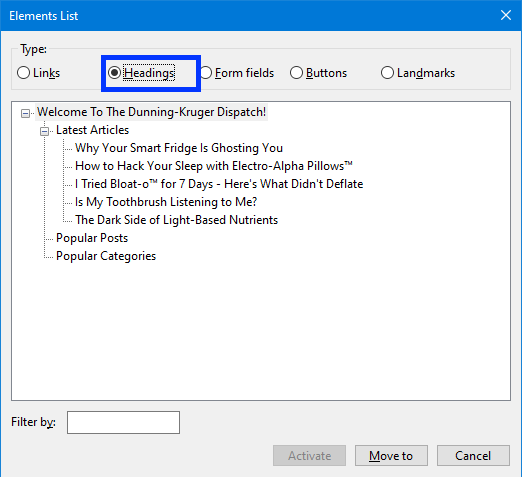
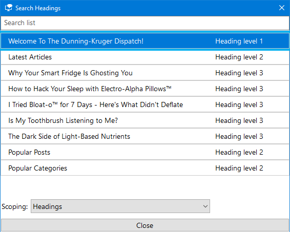

**The code to accompany this post is "[Headings](https://github.com/anthonycosgrave/fasthtml-web-a11y/tree/main/headings)". Screen reader required!**

At a glance, sighted users can scan a page to understand its structure, hierarchy, and key sections. Users navigating with screen readers, for example, need that same structure communicated programmatically using properly marked-up heading elements.

Good headings act like a **table of contents** for your page. They help **all users**, not just those using assistive technology (AT), navigate content efficiently.

<table-of-contents selector="h2, h3, h4, h5" summary="Overview"></table-of-contents>

## Why headings matter

According to the [2024 WebAIM Screen Reader Survey](https://webaim.org/projects/screenreadersurvey10/#finding), **71.6%** of respondents said they frequently navigate through headings. The usefulness of heading levels has continued to rise, with **88.8%** reporting them as "very or somewhat useful" for finding information.

Despite those statistics, the most recent [WebAIM Million Project](https://webaim.org/projects/million/#headings) found that **39% of home pages** skipped heading levels, and nearly **10%** had **no headings at all** - a clear sign that many pages lack accessible structure.

There are two parts to using headings effectively:  
1. Structuring your content with the correct semantic HTML elements.  
2. Writing clear, descriptive headings that reflect the content they introduce.

## Good structural heading practices

Use headings to create a clear, logical outline of your page content by following these semantic rules:

- Use **one `<h1>` per page** for the main topic (often matching the page title).  
- Use `<h2>` through `<h6>` to create a meaningful content hierarchy.  
- Don't skip heading levels within the same section (e.g. avoid jumping from `<h2>` to `<h4>`).  
- Avoid using heading elements purely for visual styling - use CSS instead.

## Clear and descriptive headings

Think of headings as an **outline** for your content that helps everyone, including those using AT, navigate easily. They should also:

- Describe the section that follows and set clear expectations.  
- Make sense when read out of context (e.g., in a screen reader's heading list).  
- Clearly reflect the content they introduce.  
- Be understandable on their own, without additional context.

## Screen reader heading naviation examples

**Code:** **There is some code associated with this post that you can run and interact with.**

Screen reader users rely on headings for quick navigation. Here are common ways to access heading lists and navigate between headings using the NVDA and Narrator screen readers.

### NVDA Headings navigation

**On page navigation:** Press `H` to jump to the **next** heading, `Shift + H` to go to the **previous** one.  

Alternatively, using the **Elements List** functionality:

Press `<NVDAKey> + F7`, then `Alt + H` to open the headings list the user can navigate this list to select the heading they want.

### Narrator Headings naviation

**On page navigation:** Press `H` to jump to the **next** heading, `Shift + H` to go to the **previous** one. 

Alternatively, using the **Elements List** functionality:

Press `Insert + F6` to open the headings list and select the heading they want.  

### Demonstration

In the section of the below video (8:43 to 10:44), accessibility expert [Leonie Watson](https://tink.uk/) demonstrates how proper headings help screen reader user to navigate a page's content.

<lite-youtube videoid="OUDV1gqs9GA" title="How A Screen Reader Users Surfs The Web" params="start=524&end=643" style="background-image: url('https://i.ytimg.com/vi/OUDV1gqs9GA/hqdefault.jpg');">
  <a href="https://youtu.be/OUDV1gqs9GA?si=BqX74BatoEe4zg6I" class="lyt-playbtn" title="Play Video">
    Play Video: Smashing TV: How A Screen Reader Users Surfs The Web. Video starts at 8 minutes and 43 seconds in.
  </a>
</lite-youtube>

## WCAG Success Criteria

These WCAG success criteria relate to the accessibility topics covered in this post.

**[1.3.1 Info and Relationships (AA)](https://www.w3.org/WAI/WCAG22/Understanding/info-and-relationships.html)** - Information, structure and relationships must be clear in code or available as text so assistive technologies can understand them.

**[2.4.6 Headings and Labels (AA)](https://www.w3.org/WAI/WCAG22/Understanding/headings-and-labels.html)** - Headings and labels should clearly describe the topic or purpose of the content they refer to.

**[2.4.10 Section Headings (AAA)](https://www.w3.org/WAI/WCAG22/Understanding/section-headings.html)** - Headings should be used to organize sections of content so people can navigate and understand the page structure.
