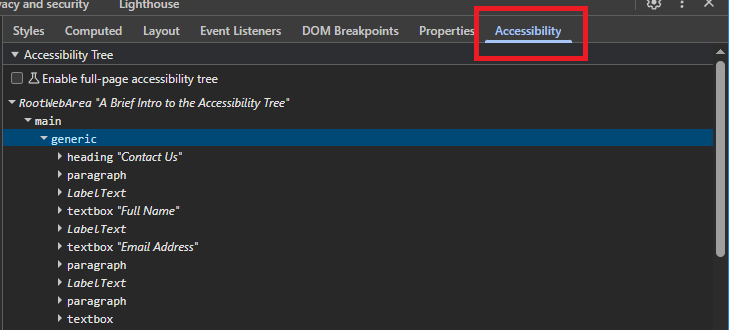
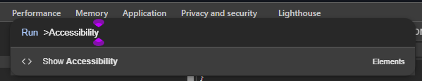
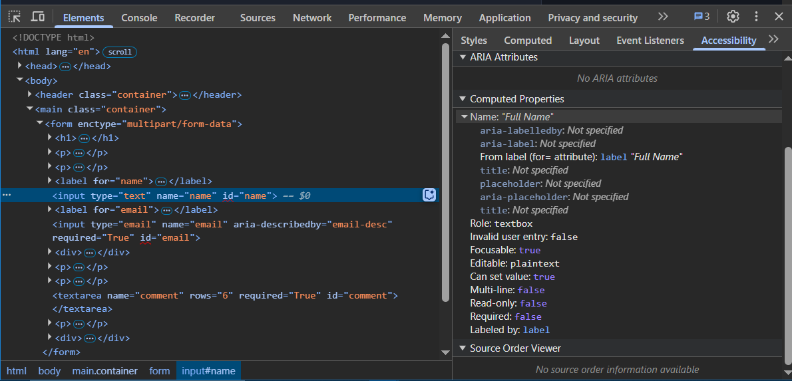
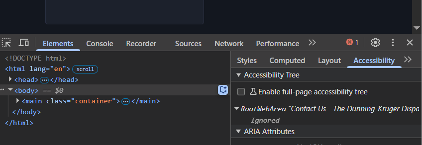

**The code to accompany this post is "[Intro to the accessibility tree"](https://github.com/anthonycosgrave/fasthtml-web-a11y/tree/main/intro_to_the_accessibility_tree)". Screen reader required!**

Web accessibility, or “web a11y”, is about making websites and apps usable by everyone. For some people, this can mean removing barriers that make digital content difficult or impossible to use. Many rely on **[assistive technologies (AT)](https://webaim.org/articles/motor/assistive)** to navigate and interact with content. For example, screen readers support people who are blind or have low vision, keyboard-only input or voice recognition software assist people with limited mobility, and braille displays help people who are deaf-blind. Some people may need to use more than one type of AT together.

These technologies depend on the **accessibility tree** to convey information about the page and help people understand what they are interacting with.

<table-of-contents selector="h2, h3, h4, h5" summary="Overview"></table-of-contents>

## The accessibility tree

The **Document Object Model** (DOM) is a structured representation of a web page created by the browser after parsing HTML, applying CSS and running any JavaScript. The accessibility tree is a **subset** of the DOM, generated by the browser and mapped through the operating system's [Accessibility APIs (AAPIs)](https://www.w3.org/TR/core-aam-1.1/#intro_aapi) to the ATs.

The accessibility tree serves as the bridge between web content and ATs. This enables people to interact with web content based on their needs, whether through spoken feedback, tactile output, or alternative input methods.

Elements are excluded from the accessibility tree if they are removed from or hidden in the DOM using CSS (e.g., `display: none;` or `visibility: hidden;`), 
the `hidden` HTML attribute, or `aria-hidden="true"`. An element is included only if it is determined that it provides meaningful information to the person. Since [AAPIs are OS-specific](https://www.w3.org/TR/core-aam-1.1/#comparing-accessibility-apis), content representations may vary across different browser and AT pairings, e.g. different screen readers may announce content *slightly* differently. These variations are expected and not considered a bug, as they depend on OS-level accessibility implementations. 

## ARIA

ARIA (**A**ccessible **R**ich **I**nternet **A**pplications), part of the W3C's [Web Accessibility Initiative (WAI)](https://www.w3.org/WAI/), provides additional semantic information when HTML alone isn't enough. It can be particularly useful for dynamic content and custom interactive components - when used correctly.

At the same time, ARIA is complex and has strict rules. Misuse can create serious accessibility barriers rather than removing them. The official [ARIA Authoring Practices Guide](https://www.w3.org/WAI/ARIA/apg/practices/read-me-first/) even cautions: **“No ARIA is better than Bad ARIA.”** Supporting this, the [2025 WebAIM Million study](https://webaim.org/projects/million/#errors) found that pages using ARIA tended to have *more* accessibility errors than those without, likely due to the additional complexity it introduces.

ARIA is a complex topic that will get deeper exploration in a future post. 

The following is a high-level overview focused on understanding how semantic HTML creates the foundation for accessibility and what ARIA can provide.

### Semantic HTML

Semantics convey purpose. There are more than 100 semantic elements in HTML that represent various types of content and interactive controls. Semantic HTML indicates **what an element is** and **how it should be used**. For example:

* `<html>` - the root element and top-level container of every valid HTML document.  
* `<h1>`, `<h2>`, `<h3>`, `<h4>`, `<h5>`, `<h6>` - represent 6 levels of page heading.  
* `<button>` is a button element.  
* `
` is for a paragraph of content.  
* `<ul>` and `<ol>` are both lists containing `<li>` items, but differ semantically: `<ul>` represents an unordered list while `<ol>` indicates the order is meaningful.  

When you use semantic HTML, you **automatically** get accessibility benefits through **implicit** roles. A **role** defines the purpose or type of an element, communicating its meaning and function to assistive technologies.

* `<h1>`, `<h2>`, etc. get `role="heading"` with their corresponding number being an `aria-level` attribute e.g. `<h2>` would have an `aria-level=2`.  
* `<button>` gets `role="button"` which communicates its interactive nature.
* `<nav>` gets `role="navigation"`.
* Roles can be shared by more than one element e.g. `<ul>` and `<ol>` both map to `role="list"`, `<input type="text">` and `<textarea>` map to `role="textbox"`.  
* Some elements, like `` and `
`, map to `role="generic"`, and text-level semantics like `<strong>` and `<em>`, may be excluded from the accessibility tree. ATs like screen readers can be configured to apply text-level semantics, if present, to words in their text-to-speech.

This built-in accessibility information is passed to the AT through the accessibility tree, providing structure and meaning without any additional development work. For reference, here is the [full W3 list of HTML element ARIA role mappings](https://www.w3.org/TR/html-aria/#docconformance).

### Using ARIA

The ["W3C's First Rule of ARIA Use"](https://w3c.github.io/using-aria/#rule1) officially recommends using native HTML elements or attributes where possible instead of re-purposing an existing element - e.g. `
` as a button - and adding ARIA to it.

However, there are situations where HTML alone isn't sufficient for complex or dynamic content, ARIA allows developers to:

* **Set explicit roles** to extend or override native semantics using the role attribute: e.g. `role="dialog"` on a custom modal.  
* **Communicate element state** such as `aria-expanded` on a collapsible section, `aria-pressed` on a toggle button, or `aria-current` on the active page in a navigation menu.
* **Provide additional properties** to clarify relationships or visibility: e.g. `aria-label` to name an icon button, `aria-labelledby` to associate a control with its visible label, or `aria-hidden` to hide decorative content from AT.  

**Note: ARIA states (e.g. aria-expanded, aria-pressed) and certain properties (e.g. aria-hidden), are meant to change as users interact with the page. JavaScript is usually needed to update their values so that AT and the person using them get the correct information.**

## Accessibility tree objects

Each element from the DOM included in the accessibility tree is represented as an object with attributes that help convey information - e.g. purpose, state, and context. 

**Common attributes of accessibility tree objects:**

- **Role** – What the element *is* and how it should be *used*. Derived from its implicit or explicit ARIA role.  
- **Name** – Also known as the "accessible name" (accName). Identifies the element for AT e.g. a button labelled "Save Changes" will be announced as "Save Changes".  
- **Description** – Provides additional context beyond the role and name e.g. explaining input format requirements.  
- **State** – Indicates status e.g. checkbox checked, button pressed, dropdown expanded.  

**Additional attributes (when relevant):**

- **Properties** – an element might be `required`, `focusable`, etc.  
- **Relationships** – Some elements are only meaningful in relation to others: a label linked to an input, radio buttons grouped together, or descriptions associated with form fields. 

**Note: The details of how names and descriptions are calculated are outside the scope of this post. For more, see [Accessible Name and Description Computation](https://www.w3.org/TR/accname-1.1/#mapping_additional_nd_te).**

## Viewing the accessibility tree in browser DevTools

The accessibility tree is available to inspect, just like you might with elements in the DOM, in most modern browser DevTools.  

### The Accessibility panel

In **Chromium** browsers (e.g. Chrome, Edge, Brave) the "Accessibility" Panel should be an option in your DevTools as shown in the image below.  

  

If you don't see it you can also try (with your DevTools open):  
    1. Pressing **Ctrl**+**Shift**+**P** (on Windows/Linux) or **Command**+**Shift**+**P** (on Mac) to open the "Command Menu".  
    2. Start typing "Accessibility".  
    3. Press "Enter" or click on the "Show Accessibility" option in the list.  
      
  

You can then view the Accessibility tree object attributes of each element by clicking on them in the DOM tree view and any accessibility information will appear on the right hand side. 

  

### Enabling the full-page accessibility tree view

You can swap the DOM tree view with an easy-to-read hierarchical view of the Accessibility tree.

While on the Accessiblity Panel:
  1. Check the box labeled "Enable full-page accessibility tree".
  2. You may be prompted with a message that a reload is required, click the "Reload DevTools" button.
  3. After the reload, click on the accessibility icon that appears in the "Elements" section to switch to the Accessibility tree view.

  

**NOTE: Once you have enabled the full-page view you can toggle between it and the DOM view by pressing the 'a' key on your keyboard.**  

Use either view to inspect the accessibility tree information in the code example to see what is and is *not* included.  

## The code example with the NVDA screen reader

Below is a screen recording of how the [NVDA screen reader](https://www.nvaccess.org/download/) (on Windows 10) uses the accessibility tree to announce the content of the page. 

NVDA announces the page content for the first 34 seconds, it displays the pink rectangle as it navigates the page. From roughly 35 seconds onward, I am using the keyboard to navigate and interact with the elements to highlight how they are announced. For the purposes of demonstration, I have greatly reduced the speed at which NVDA announces content.

<lite-youtube videoid="648Om4SaYKk" title="Contact Us NVDA Screen Reader Demo" style="background-image: url('https://i.ytimg.com/vi/648Om4SaYKk/hqdefault.jpg');">
  <a href="https://youtu.be/648Om4SaYKk" class="lyt-playbtn" title="Play Video">
    Play Video: Contact Us NVDA Screen Reader Demo
  </a>
</lite-youtube>

Some important things worth noting:  
1. The telephone icon beside the phone number might look visually appealing but being announced as 'telephone receiver' may be confusing to a non-sighted person.  
2. Notice all the information announced every time the "Email Address" field is focused.    
3. To a sighted person it may be safe to assume the large `textarea` is where they should enter their comment and they should not include emojis. NVDA first announces all the page content it gets from the accessibility tree - when the pink focus indicators are visible. However, it does not announce any of the information that a sighted person would identify as relevant when the `textarea` is subsequently focussed (the blue focus indicator).  