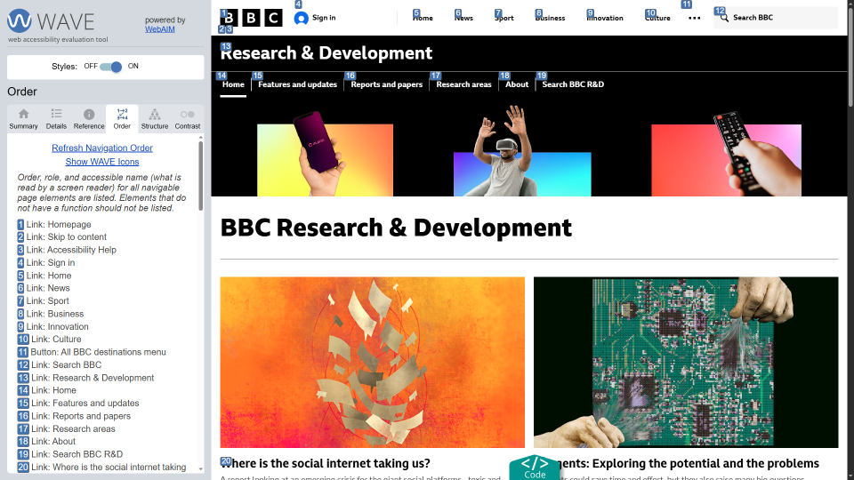

**The code to accompany this post is "[Keyboard Navigation"](https://github.com/anthonycosgrave/fasthtml-web-a11y/tree/main/keyboard_navigation)"**

This post provides a high-level overview of keyboard accessibility and highlights common issues that can arise.

In an earlier post, we covered the [four core principles](../fasthtml-web-a11y/wcag-basics.md#pour-the-four-principles) for web accessibility: Perceivable, **Operable**, Understandable, and Robust (POUR). Keyboard accessibility is essential for making the web **operable**. It's a [Level A](https://www.w3.org/WAI/WCAG22/Understanding/keyboard.html) - the lowest level - requirement because it's considered a **basic** accessibility expectation.

Many people rely on keyboards due to [motor disabilities](https://webaim.org/articles/motor/motordisabilities), temporary injury, or choose to use  them as a personal preference. These keyboard-only users need to navigate content and complete tasks without a mouse, making keyboard accessibility critical for inclusive web experiences. 

The term *"keyboard-only users"* is a broad term that includes people navigating with a traditional keyboard as well as those using alternative input methods like [switch controls](https://www.24a11y.com/2018/i-used-a-switch-control-for-a-day/), [sip-and-puff](https://youtu.be/D_Siea79t4M?si=-e0aMqMyyjJSJXRE), [head wands](https://webaim.org/articles/motor/assistive#headwand) or voice commands.

<table-of-contents selector="h2, h3, h4, h5" summary="Overview"></table-of-contents>

## An important note for MacOS users

Keyboard accessibility *might not be enabled by default*. Please see [Deque University's guide](https://dequeuniversity.com/mac/keyboard-access-mac) for instructions.

## What keyboard users expect

Keyboard navigation is typically *linear*. Pressing the `Tab` key should move through the focusable elements on a page with predictable behaviour. Some common keyboard commands are:

- **`Tab` or `Shift + Tab`** - Move forwards or backwards through focusable elements.
- **`Enter`** - Activate links and buttons.
- **`Space`**-  Toggle checkboxes, activate buttons, or scroll the page.
- **Arrow keys** - Navigate within widgets like radiobutton groups, menus, tabs, or sliders.  
- **`Home` / `End` (Windows)** or **`Fn + Left Arrow` / `Fn + Right Arrow` (MacOS)** - Move to first or last item within widgets.
- **`Esc`** - Close popups, modals, or menus.

WebAIM provides a [comprehensive list of the most common keyboard interactions](https://webaim.org/techniques/keyboard/#testing).

Many of these behaviours are **provided automatically by native HTML elements** such as `<button>`, `<a>`, `<input>`, `<select>`, and `<textarea>`. When used correctly, these elements handle focus, activation, and keyboard interaction without extra code. Custom controls require additional work to replicate this functionality.

## Common pitfalls

### No Skip link(s)

Users are forced to tab through repetitive content and navigation on every page. See [Skip Links](../fasthtml-web-a11y/skip-links.md) for more details.

### Device dependent functionality

This usually means requiring mouse input to complete a task or reveal information.

#### Relying on the `title` attribute to reveal information

The `title` attribute is often misused as a type of "tooltip" on `<input>` elements to show expected input or formatting. It may be announced by some screen readers, but inconsistently, and is not available to keyboard-only users. The Web Hypertext Application Technology Working Group (WHATWG)'s HTML Spec states that ["relying on the title attribute is currently discouraged"](https://html.spec.whatwg.org/multipage/dom.html#the-title-attribute) due to poor accessibility.

**Note:** Important information should be **visible by default** and not depend on a specific or interaction to reveal it.

#### JavaScript mouse-specific event handling

Additional code may be written for keyboard-based events but consider if the necessary functionality can be provided using device-independent JavaScript event handlers.

Device-independent event handlers include:
- [`onfocus`](https://developer.mozilla.org/en-US/docs/Web/API/Element/focus_event) - triggers when an element receives focus.
- [`onblur`](https://developer.mozilla.org/en-US/docs/Web/API/Element/blur_event) - triggers when an element loses focus.
- [`onchange`](https://developer.mozilla.org/en-US/docs/Web/API/HTMLElement/change_event) - triggers when an element's value changes and loses focus.  
- [`onclick`](https://developer.mozilla.org/en-US/docs/Web/API/Element/click_event) - triggers when `<button>` elements are activated via keyboard or mouse.
- [`onsubmit`](https://developer.mozilla.org/en-US/docs/Web/API/HTMLFormElement/submit_event) - triggers when forms are submitted.

#### CSS rules for mouse-only interactions

As mentioned in the `title` attribute section above, don't rely on device-specific interactions to reveal important information, **make it visible by default**.

Instead of relying solely on `:hover`, consider including [`:focus`](https://developer.mozilla.org/en-US/docs/Web/CSS/:focus) and [`:active`]([`:active`](https://developer.mozilla.org/en-US/docs/Web/CSS/:active)) states so styles work for mouse, keyboard and touch. For example:

```css
/* Instead of hover-only */
.tooltip:hover .tooltip-content {
  ...
}

/* Use combined states */
.tooltip:hover .tooltip-content,
.tooltip:focus .tooltip-content,
.tooltip:active .tooltip-content {
  /* apply styling...*/
}
```

### Tab order does not follow visual order

When pressing `Tab` or `Shift + Tab` does not follow a logical visual sequence i.e. *next* or *previous* focusable element, navigation becomes confusing for keyboard users.

To prevent this, try to keep the HTML code in a logical reading order to ensure that the tab sequence matches the visual layout. 

Be aware [CSS Grid's `order` property](https://developer.mozilla.org/en-US/docs/Web/CSS/order) and [Flexbox's `order` property](https://developer.mozilla.org/en-US/docs/Web/CSS/CSS_flexible_box_layout/Ordering_flex_items#the_order_property) can change the [visual order of elements](https://gridbyexample.com/examples/example14/) without changing the DOM. This can create mismatches between what the users see and how the keyboard focus moves through the page.

Avoid using *positive* `tabindex` values - e.g. `tabindex="1", tabindex="2"` - they can create unpredictable tab order. Use `tabindex="0"` to *add* otherwise non-focusable elements to the natural tab order and `tabindex="-1"` to *remove* elements from the tab order.

#### Verifying `Tab` order

The WebAIM WAVE extension can visually display the tab order of interactive elements. This helps to confirm that the sequence matches the expected reading order and avoids confusion for keyboard users.

WAVE is [browser extension](https://chromewebstore.google.com/detail/jbbplnpkjmmeebjpijfedlgcdilocofh?utm_source=item-share-cb) launched from the browser extension toolbar or the context menu "WAVE this page" option.

Below is a screenshot of WAVE showing the tab order and visual order of the [BBC R&D homepage](https://www.bbc.co.uk/rd).



### Low contrast or no visible focus 

Focus indicators for keyboard users serve the same purpose as the cursor for mouse users. If users cannot see where they are on a page, they cannot navigate or complete a task confidently.

This is often caused by removing outlines (e.g. `outline: none`) or styling focus outlines with very low contrast making they difficult to see against the page's background. See [post on creating accessible focus for keyboard users](../fasthtml-web-a11y/focus-indicators.md).

### Keyboard traps

Users can become stuck in controls they cannot `Esc` or `Tab` out of, e.g. modals requiring users to click on an icon to close them. Ensure modals and complex widgets allow exiting using keyboard commands.  

### Custom components without keyboard support

Replacing native buttons or links, often with divs or spans, without providing full keyboard functionality is a frequent accessibility failure. 

As mentioned earlier, use native HTML elements (when possible) for their built-in keyboard support, or ensure custom components have proper focus management and ARIA attributes (will be covered in a future post).  

## WCAG Success Criteria

These WCAG success criteria relate to the accessibility topics covered in this post.

**[2.1.1 Keyboard (Level A)](https://www.w3.org/WAI/WCAG22/Understanding/keyboard.html)** - All functionality must be operable using a keyboard or other assistive input, without requiring a mouse.

**[2.1.2 No Keyboard Trap (Level A)](https://www.w3.org/WAI/WCAG22/Understanding/no-keyboard-trap)** - Users must be able to navigate through and interact with a page without getting "stuck" on any element.

**[2.4.3 Focus Order (Level A)](https://www.w3.org/WAI/WCAG22/Understanding/focus-order)** - The order in which users navigate through the interactive elements on a page must be logical and predictable.

**[1.4.13 Content on Hover or Focus (Level AA)](https://www.w3.org/WAI/WCAG22/Understanding/content-on-hover-or-focus)** - Content that appears when a user focuses or hovers over an element must be easy to close and remain visible as long as needed.  