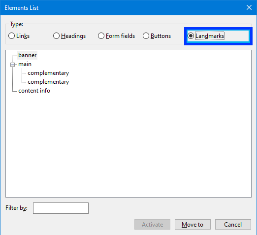
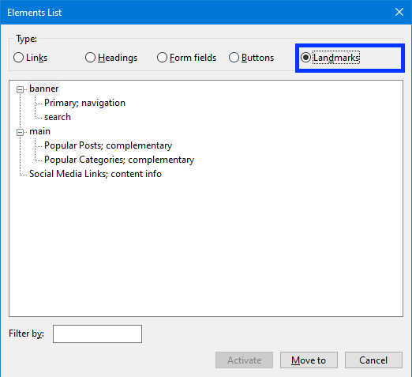
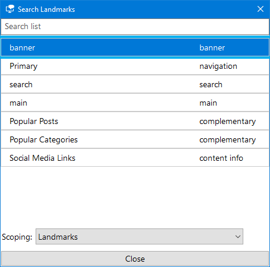

**The code to accompany this post is "[Landmarks](https://github.com/anthonycosgrave/fasthtml-web-a11y/tree/main/landmarks)". Screen reader required!**

Landmarks provide key navigation points on a page. Screen reader users can jump to the main content, navigation, search areas, or other important regions quickly. Without landmarks, users may have to traverse **every** menu item, social media icon, and advertisement before reaching the content they want, if they have not already left the website out of frustration.

<table-of-contents selector="h2, h3, h4, h5" summary="Overview"></table-of-contents>

## Why landmarks matter

Despite their importance, landmarks are underused. The [WebAIM Million project](https://webaim.org/projects/million/#regions) found that while 80% of home pages have at least one landmark, only 42.6% used a main content landmark. The [2024 WebAIM Screen Reader Survey](https://webaim.org/projects/screenreadersurvey10/#landmarks) shows that 31.8% of screen reader users frequently navigate by landmarks, highlighting a gap between user needs and current implementation.

### A real world example

In the section of the below video (6:57 to 8:43), accessibility expert [Leonie Watson](https://tink.uk/) demonstrates how landmarks help a screen reader user to understand and navigate the structure of a page.

<lite-youtube videoid="OUDV1gqs9GA" title="How A Screen Reader Users Surfs The Web" params="start=417&end=523" style="background-image: url('https://i.ytimg.com/vi/OUDV1gqs9GA/hqdefault.jpg');">
  <a href="https://youtu.be/OUDV1gqs9GA?si=DDa3Ofm0xZRO0j3k" class="lyt-playbtn" title="Play Video">
    <span class="lyt-visually-hidden">Play Video: Smashing TV: How A Screen Reader Users Surfs The Web. Video starts at 6 minutes and 57 seconds in.</span>
  </a>
</lite-youtube>

## Native HTML landmark elements

All major screen readers include keyboard shortcuts for moving between landmarks, making them one of the fastest ways to navigate page layouts. Most landmarks come directly from semantic HTML elements, giving screen readers built-in navigation points without extra coding. The key is to use them thoughtfully when structuring the page, but not so many that they overwhelm users. The following are the semantic HTML elements, their FastHTML counterparts and their associated landmark:

### `<header>` - `Header()` - Banner
Site-wide content like your logo and main navigation.

### `<nav>` - `Nav()` - Navigation  
Menus and navigation links.

### `<main>` - `Main()` - Main Content
The page's primary content - there should only be one per page.

### `<footer>` - `Footer()` - Content Info
Page footer with copyright, contact info, or company links.

### `<aside>` - `Aside()` - Complementary
Related content like sidebars, author bios, or "related articles."

### `<form>` - `Form` - Form
Any form for user input like contact forms.

### `<form role="search">` or `<search>` - `Form(role="search")` or `Search()` - Search
Specifically for search functionality. `<search>` is semantically correct and [works across the latest browser versions](https://caniuse.com/?search=%3Csearch%3E) but may not work on older devices or browsers.

### `<section>` - `Section()` - Region
Generic sections that need to be provided with a heading or label to be useful landmarks.

## Giving landmarks clear and understandable names

Without a meaningful name, a screen reader may announce a landmark by its role, e.g. “navigation”, or not announce it at all. An unlabelled landmark can appear vague and leave a user unsure as to its purpose. The below screenshot shows how unlabelled landmarks appear to the NVDA screen reader.



It would be much clearer when trying to navigate a page if those elements were properly named as "Author Biography", "Related Articles" and "Footer social media links" for example.

**Note** Some screen readers announce the landmark **type** along with its **name**. Avoid repeating the type when naming landmarks, as this can result in redundant announcements such as “primary site navigation navigation.”

### Re-using visible on-page text as a label

If a landmark contains a visible heading, you can reference it with [`aria-labelledby`](https://developer.mozilla.org/en-US/docs/Web/Accessibility/ARIA/Reference/Attributes/aria-labelledby) so the heading serves as the landmark name.  

```python
Nav(
    H2("Main Menu", id="main-nav-heading"),
    aria_labelledby="main-nav-heading",
    ...
)
```

### When no visible text is available

Some visual design choices will mean there are no visible headings to reference. In those instances, use [`aria-label`](https://developer.mozilla.org/en-US/docs/Web/Accessibility/ARIA/Reference/Attributes/aria-label) to provide a name for the landmark:

```python
Nav(
  aria_label='Social Media Links',
  ...
)
```

### Managing multiple landmarks of the same type  

If a page has more than one landmark of the **same type** (e.g. a navigation menu at the top and another at the bottom) give each one a **unique name**. For instance, you could label them “Primary site” and “Footer links.”

Without unique names, a user might hear the same landmark announced at the bottom of the page that they already heard at the top, which can be confusing.

As mentioned above, use `aria-labelledby` if the landmark has an appropriate visible heading otherwise, use `aria-label`.

### How Screen Readers present landmark information

Screen readers let users navigate landmarks jumping between them with keyboard shortcuts or via an "Elements" list. You can see in the sections below how the [NVDA](https://www.nvaccess.org/download/) and [Windows Narrator](https://support.microsoft.com/en-us/windows/complete-guide-to-narrator-e4397a0d-ef4f-b386-d8ae-c172f109bdb1) screen readers present the landmarks to a user.

#### NVDA 

**On page navigation:** Press the `D` key to jump to the **next** landmark. `Shift + D` will jump to the **previous** landmark.  

Alternatively, using the **Elements List** functionality:  

Press `<NVDA Key> + F7` and then `Alt + D` to access the list of available landmarks. 



#### Windows Narrator

**On page navigation:** Press the `D` key to jump to the **next** landmark. `Shift + D` to jump to the **previous** landmark.  

Alternatively, using the **Elements List** functionality:

Press `Insert + F5` to bring up the list of landmarks in Narrator.  



## WCAG Success Criteria

These WCAG success criteria relate to the accessibility topics covered in this post.

**[1.3.1 Info and Relationships (Level A)](https://www.w3.org/WAI/WCAG22/Understanding/info-and-relationships.html)** - Information, structure and relationships must be clear in code or available as text so assistive technologies can understand them.

**[2.4.1 Bypass Blocks (Level A)](https://www.w3.org/WAI/WCAG22/Understanding/bypass-blocks.html)** - Users must have a way to skip repeated blocks of content, like navigation menus, so they can get to the main content quickly.

**[2.4.6 Headings and Labels (Level AA)](https://www.w3.org/WAI/WCAG22/Understanding/headings-and-labels.html)** - Headings and labels should clearly describe the topic or purpose of the content they refer to.

**[2.4.10 Section Headings (Level AAA)](https://www.w3.org/WAI/WCAG22/Understanding/section-headings.html)** - Headings should be used to organize sections of content so people can navigate and understand the page structure.