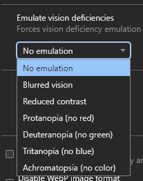
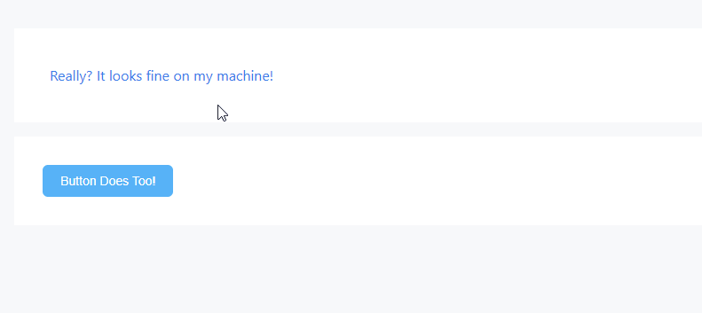
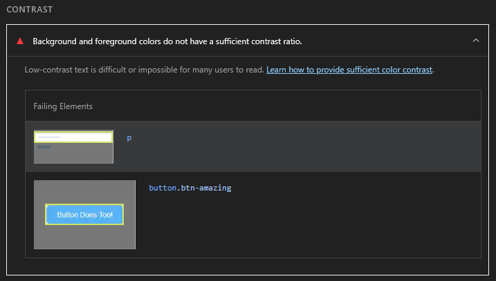
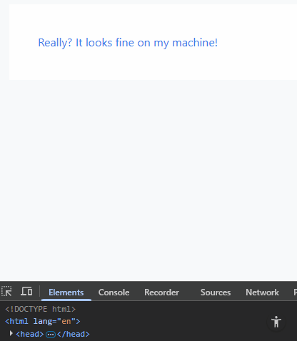
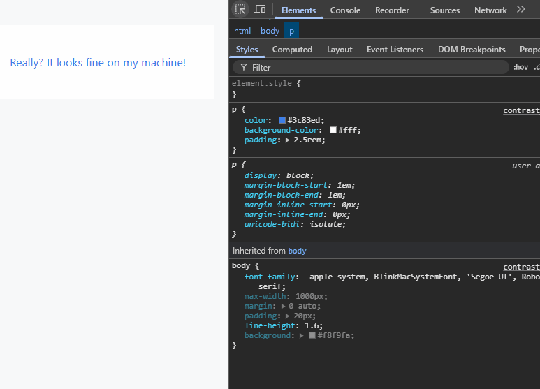
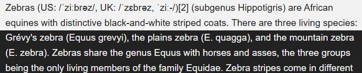

**The code to accompany this post is "[Low Contrast Text](https://github.com/anthonycosgrave/fasthtml-web-a11y/tree/main/low_contrast_text)"**

Low contrast is the **most commonly detected** yet easily avoidable accessibility issues. It affects page text, form controls, and the contrast between controls and their backgrounds. The 2025 [WebAIM Million Report](https://webaim.org/projects/million/#contrast) found that nearly 80% of the one million home pages failed to meet the minimum contrast ratio of **4.5:1** between text colour and background colour. It has persisted as the top reported issue since 2019.

<table-of-contents selector="h2, h3, h4, h5" summary="Overview"></table-of-contents>

## What is contrast?

Contrast is a measure of the difference in perceived brightness (luminance) between foreground and background colours. It is measured as a **contrast ratio** from **1:1** (no contrast) to **21:1** (maximum contrast).

## Why low contrast is a serious issue

Low contrast text makes it difficult for people to perceive letterforms, which reduces reading speed and comprehension. This affects everyone to some degree but is especially problematic for people with low vision, colour vision deficiency, or those reading in suboptimal conditions.

The scale of the impact is huge. A [World Health Organisation report in 2019](https://www.who.int/publications/i/item/world-report-on-vision) estimated 2.2 billion people globally have some form of visual impairment. [Colour Blind Awareness](https://www.colourblindawareness.org/colour-blindness/) reports that "1 in 12 men (8%) and 1 in 200 women" are affected by colour blindness - an estimated 300 million people globally. 

## The text contrast requirements

The WCAG define [*minimum*](https://www.w3.org/WAI/WCAG21/Understanding/contrast-minimum.html) contrast ratios between text and its background. 

* "Normal" or "body" text must have a ratio of **at least 4.5:1** (Level AA)  
* "Large" text must have **at least a 3:1** ratio (Level AA) when:
    * 24px or larger, e.g. a `<h1>` header
    * **bold** text that is 18.66px or larger 

The [*enhanced*](https://www.w3.org/WAI/WCAG21/Understanding/contrast-enhanced.html) - Level AAA - contrast ratios are:

* "Normal" or "body" text is **at least 7:1**
* "Large" text is **at least 4.5:1**

## The UI components and graphical objects contrast requirements

While the focus of this post is text contrast requirements, it is worth being aware that there is a [non-text contrast ratio of 3:1](https://www.w3.org/WAI/WCAG21/Understanding/non-text-contrast.html). This ratio applies to non-disabled UI elements like buttons, form fields, borders, icons, and the text *within* UI components. 

And even though there is no "enhanced" Level AAA ratio for non-text contrast, in general aiming for higher contrast and better accessibility is still recommended.

### Exceptions

Some elements are exempt from contrast requirements:

1. Company Logos and brand names.
2. Decorative or incidental/placeholder text e.g. "lorem ipsum".
3. Disabled controls (however, be conscious that low contrast will still impact visibility).

## Emulating vision impairments with DevTools

Visual impairments can be difficult to understand without first-hand experience. While emulation cannot replace lived experience, modern browsers can provide a degree of insight by simulating common vision conditions. This can also help challenge assumptions about design choices and their impact on visibility. 

In Chromium based browsers (e.g. Chrome, Edge, Brave) you can emulate vision deficiencies using DevTools. 

With your DevTools open:

1. Open the Command Palette via `Ctrl + Shift + P` (Windows) or `Cmd + Shift + P` (MacOS).
2. Type "Rendering".
3. Press Enter or click on "Show Rendering".
4. On on the "Rendering" panel scroll down to find the dropdown list titled "Emulate vision deficiencies". 
5. Click an item in the list, e.g. "Reduced contrast", to have it immediately applied to the rendering of the current web page. 

**Be aware that once the DevTools are closed the emulated vision deficiency will be stopped too.**

## Resolving contrast issues

It is easiest to address contrast during the design phase by selecting foreground and background colours that meet any branding constraints and required contrast ratios.

For those not involved in the design or those using 3rd party CSS libraries or frameworks, automated accessibility tools can identify low contrast issues. These include browser extensions such as WebAIM's WAVE or audit tools like Google's Lighthouse. 

Some developer tools also allow for temporary adjustments of colours **directly in the browser** for real time feedback.

### Automated contrast checkers

Automated tools do not detect **all** issues, but they are effective for identifying low contrast without checking each element individually.

*Always make sure to test with light and dark themes if you are using them!*

#### WebAIM's WAVE Tool

Available as a [browser extension](https://chromewebstore.google.com/detail/jbbplnpkjmmeebjpijfedlgcdilocofh?utm_source=item-share-cb) and launchable from the browser extension toolbar or, as shown below, the right click context menu "WAVE this page" option.

This example shows how two low contrast elements - a `
` containing text and a `<button>` - are identified and reported by WAVE:

#### Google Lighthouse 

[Lighthouse](https://developer.chrome.com/docs/lighthouse/overview#devtools) in Chrome DevTools.

1. Open the Command Palette `Ctrl + Shift + P` (Windows) or `Cmd + Shift + P` (MacOS).
2. Type "Lighthouse". 
3. Press Enter or click on "Show Lighthouse".
4. Check the "Accessibility" checkbox under the "Categories" heading.
5. Click the "Analyze page load" button to begin generating the report.

And this is how those same two low contrast elements are reported by Lighthouse:

**Note:** A useful approach when evaluating CSS libraries is to run WAVE or Lighthouse on their demo pages to catch obvious issues. These tools can help identify basic problems before adopting a library. However, keep in mind that many of these projects may support legacy versions of browsers and older codebases, so some accessibility issues may reflect ongoing work rather than neglect.

### In browser contrast checking

Chromium browsers (e.g. Chrome, Edge, Brave) and Firefox offer in-browser contrast tools. I have personally found the Chromium based ones to be currently more useful.

You can inspect an element in the DOM as shown below and see accessibility information related to it in the popup. 

In the "Accessibility" section in the lower part of the popup, it has identified that the text's colour and the background colour have a contrast ratio of 3.7 (i.e. 3.7:1). There is a useful warning symbol beside it alerting you to the fact it fails the **minimum** contrast ratio requirement of 4.5:1.

#### Suggested Level AA and Level AAA contrast ratios

An incredibly useful feature are the suggested `color` values that meet the 4.5:1 (Level AA) and 7:1 (Level AAA) contrast ratios and the ability to view them in-browser. **This only works with a `color` attribute**; it won't work on a `background-color` for example. The same approach works for UI elements too like `<button>`.

A useful combination for resolving contrast issues is to WAVE or Lighthouse a web page and then use the in-browser tools to choose compliant `color` values.

**Remember to copy the values and add them to your CSS file(s). The DevTools won't retain any in-browser changes.**

## Text selection styling with `::selection`

The [`::selection`](https://developer.mozilla.org/en-US/docs/Web/CSS/::selection) pseudo-element allows you to customise how text appears when a user highlights it, either by double clicking on the text or by clicking and dragging across the text. Most browsers provide a default selection style of a blue background and white text, as shown below:

Some CSS frameworks override `::selection` but fail to maintain sufficient minimum contrast between the selection background colour and the text colour. In general, when a default browser provided style is changed, **the author of the change becomes responsible for ensuring accessibility**. Changing default behaviour can negatively affect users who may have cognitive difficulties or are less familiar with technology.

**"Fun" Fact**: In the *very* early days of [html5boilerplate](https://html5boilerplate.com/), Paul Irish styled [`::selection` to be "hot pink"](https://youtu.be/oDlsOyPKUTM?si=-YYy9oYLnutXiZ1X&t=1562). It kind of became an accidental signature of the template and led to a bit of a "game" to try to identify big name sites using the template by selecting text to see if it was "hot pink" (and extremely low contrast at 2.87:1!).

## Don't rely on purely black and white for high contrast

Black-on-white text combinations reach the maximum contrast ratio of 21:1, far exceeding WCAG requirements. However, pure black (`#000000`) on pure white (`#ffffff`) is known to contribute to visual fatigue and eye strain. Slightly softened `color` values like `#1a1a1a` on `#f8f8f8` can still achieve [AAA contrast](https://colorcontrast.app/#fg=%231a1a1a&bg=%23f8f8f8%20&level=aaa&format=rgb&algo=WCAG2&filter=none) while reducing strain during extended reading. For more detailed breakdowns see: ["Never use pure black in typography"](https://uxplanet.org/basicdesign-never-use-pure-black-in-typography-36138a3327a6) and ["Alternatives to Using Pure Black (#000000) for Text and Backgrounds"](https://uxplanet.org/alternatives-to-using-pure-black-000000-for-text-and-backgrounds-54ef0e733cdb)

## WCAG Success Criteria

These WCAG success criteria relate to the accessibility topics covered in this post.

**[1.4.3 Contrast (Minimum) (Level AA)](https://www.w3.org/WAI/WCAG21/Understanding/contrast-minimum.html)** - Text and images of text must have sufficient contrast with their background - at least 4.5:1 - so that they are readable.

**[1.4.6 Contrast (Enhanced) (Level AAA)](https://www.w3.org/WAI/WCAG21/Understanding/contrast-enhanced.html)** - For maximum readability, text and images of text must have a contrast of at least 7:1 with their background.

**[1.4.11 Non-text Contrast (Level AA)](https://www.w3.org/WAI/WCAG21/Understanding/non-text-contrast.html)** - User interface components and graphical objects (e.g., charts, diagrams, icons) must have a contrast of at least 3:1 with nearby colours so they are easy to see and use.
