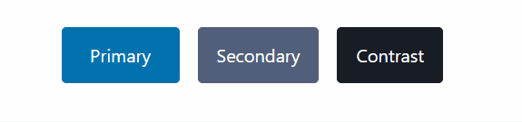
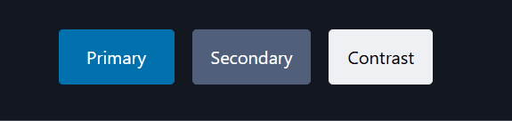
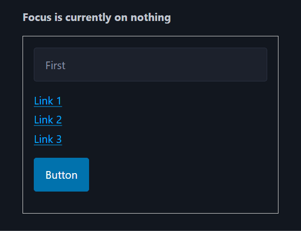
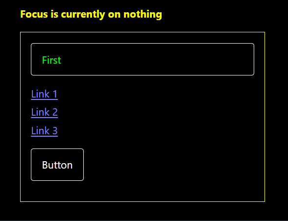
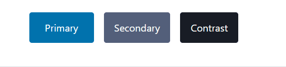
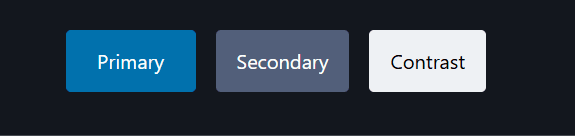
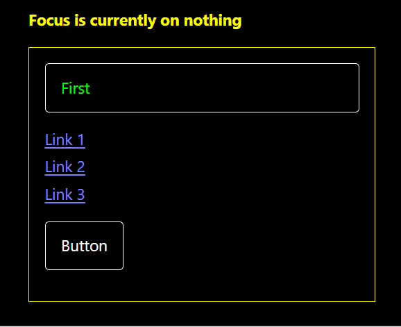

**The code to accompany this post is "[Pico CSS Focus Indicator"](https://github.com/anthonycosgrave/fasthtml-web-a11y/tree/main/pico_css_focus_indicator)"**

In ["Creating a more accessible focus indicator"](../fasthtml-web-a11y/focus-indicators.md#creating-a-more-accessible-focus-indicator), we covered the accessibility requirements and techniques for improving upon browser default focus indicators. [Pico CSS](https://picocss.com/) is commonly used in [FastHTML examples](https://gallery.fastht.ml/) and provides very useful styling and layout defaults. However, its focus indicators could be improved for better accessibility.

<table-of-contents selector="h2, h3, h4, h5" summary="Overview"></table-of-contents>

## Pico CSS focus indicators

Pico CSS has theme switching functionality to let a user change the current page theme via an on page toggle that changes the `<html data-theme="dark">`. As you can see from the below screen recordings of both themes, identifying which button is currently in focus is difficult.

### Light theme - `[data-theme=light]`



### Dark theme - `[data-theme=dark]`



## Low Colour Contrast Ratios

For both the light and dark themes in PicoCSS, the colours used for focus indicators fall below the [3:1 contrast ratio required for non-text UI components](https://www.w3.org/WAI/WCAG22/Understanding/non-text-contrast.html). The examples below use the `primary` button styles, but the same process applies to `secondary` and `contrast` variants. The CSS values were taken from the [current version 2.1.1](https://picocss.com/docs) (September 2025) of Pico CSS.

### Light theme contrast ratios

```css
--pico-background-color: #fff;
--pico-primary-focus: rgba(2, 154, 232, 0.5);
--pico-primary-background: #0172ad;
/* primary button background-color when focused */
--pico-primary-hover-background: #017fc0;
```
* **Focus indicator vs. page background**: [rgba(2,154,232,0.5) on #fff](https://colorcontrast.app/#fg=rgba(2%2C%20154%2C%20232%2C%200.5)&bg=%23fff&level=aa&format=rgb&algo=WCAG2&filter=none) is **1.76:1**, well below the required 3:1.

* **Focus indicator vs. button background (focused state)**: [rgba(2,154,232,0.5) on #017fc0](https://colorcontrast.app/#fg=rgba(2%2C%20154%2C%20232%2C%200.5)&bg=%23017fc0&level=aa&format=rgb&algo=WCAG2&filter=none) is **1.19:1**, again below 3:1.

### Dark theme contrast ratios

```css
--pico-background-color: rgb(19, 22.5, 30.5);
--pico-primary-focus: rgba(1, 170, 255, 0.375);
--pico-primary-background: #0172ad;
/* primary button background-color when focused */
--pico-primary-hover-background: #017fc0;
```

* **Focus indicator vs. page background**: [rgba(1,170,255,0.375) on rgb(19,22.5,30.5)](https://colorcontrast.app/#fg=rgba(1%2C%20170%2C%20255%2C%200.375)&bg=rgb(19%2C%2022.5%2C%2030.5)&level=aa&format=rgb&algo=WCAG2&filter=none) is **2.01:1**, below 3:1.

* **Focus indicator vs. button background (focused state)**: [rgba(1,170,255,0.375) on #017fc0](https://colorcontrast.app/#fg=rgba(1%2C%20170%2C%20255%2C%200.375)&bg=%23017fc0&level=aa&format=rgb&algo=WCAG2&filter=none) is **1.23:1**, also fails.

### Reducing the transparency is not enough 

For the light theme, an increase in the alpha value from `0.5` to `1.0` is a ratio of [3.09:1](https://colorcontrast.app/#fg=rgba(2%2C%20154%2C%20232%2C%201)&bg=%23fff&level=aa&format=rgb&algo=WCAG2&filter=none)

For the dark theme, increasing `0.375` to `1.0` provides a high contrast of [7:1](https://colorcontrast.app/#fg=rgba(1%2C%20170%2C%20255)&bg=rgb(19%2C%2022.5%2C%2030.5)&level=aa&format=rgb&algo=WCAG2&filter=none).

These changes would need to be made and tested for each button (and possibly other controls) that your site uses to maintain at least a 3:1 contrast ratio. This does not resolve a larger underlying problem with how Pico CSS handles focus indicators.

## The problem with Pico CSS's use of `outline: none`

A previous post, ["Creating a more accessible focus indicator"](../fasthtml-web-a11y/focus-indicators.md#built-in-browser-focus-indicators), highlighted how the built-in browser focus indicators use the `outline` CSS property to indicate which interactive element - buttons, inputs etc - currently has focus. And how to improve those defaults by overriding them with WCAG compliant values.

By default, Pico CSS **removes** native focus indicators by setting `outline: none` on interactive elements and uses [`box-shadow`](https://developer.mozilla.org/en-US/docs/Web/CSS/box-shadow). In some cases (particularly with buttons as shown in the previous contrast ratio calculations), it slightly changes the `background-color` of the element when in focus. While this provides a more styling options and effects, WCAG specifically advises **against** doing this i.e. ["Avoid setting outline: none to use box-shadow on its own."](https://www.w3.org/WAI/WCAG22/Techniques/css/C40) because in certain "forced-color modes" e.g. Windows High Contrast Mode the `box-shadow` won't be rendered by the browser. 

### Invisible in Windows High Contrast mode

[Windows High Contrast (Forced Colors)](https://support.microsoft.com/en-au/windows/change-color-contrast-in-windows-fedc744c-90ac-69df-aed5-c8a90125e696#:~:text=Save%20and%20apply.-,Turn%20high%20contrast%20mode%20on%20or%20off,under%20Turn%20on%20high%20contrast) is an operating-system level setting that overrides site and application UI colour palettes with a limited, user-selected high-contrast theme. Its goal is to ensure maximum readability for the user.

The first example shows Pico CSS's default behaviour **before** High Contrast mode is enabled. As focus is moved with the `Tab` key, the text at the top updates to display the currently focused element.



Now here is the same group of controls with Windows High Contrast mode enabled. Windows provides several high contrast themes; this example uses `High Contrast #1`.

Notice the following:

* The `<input>` and `<button>` still have visible borders, but that is their element `border`, not a focus indicator.  
* The links - `<a>` - have **no visible focus indicator at all**. Visually there is no way to tell where the focus is.



This happens because, as mentioned in the previous section, Pico CSS removes the default `outline` and relies on a `box-shadow`, which is suppressed in high contrast modes. While the CSS below applies to links, buttons and other inputs use a similar approach with different values for `box-shadow` colours and `border`:

```css
/* Pico CSS <a> specific focus indicator */
:where(a:not([role=button])):focus-visible {
  box-shadow: 0 0 0 var(--pico-outline-width) var(--pico-primary-focus);
}
```

The simplest and most robust fix is to reintroduce `outline` (with `outline-offset`), which works consistently across all elements and adapts automatically to high contrast themes.

## Restoring the `outline`

As covered in the [previous focus indicator post](../fasthtml-web-a11y/focus-indicators.md#), using `outline` with `outline-offset` provides a **clear and consistent** focus indicator around interactive elements. The `outline-offset` creates separation from the element, making the focused area larger and easier to see.

This approach simplifies colour selection: a single high-contrast colour can be applied to all interactive elements, avoiding the need to choose separate colours for each button, link etc variant.

### High contrast outline colours

Focus outlines must have a contrast ratio of at least 3:1 against their background. Choosing colours with higher contrast improves visibility and works better across different displays.

For example, the following colours provide strong contrast for Pico's themes:

* Dark theme: [#71a3d1 on #13171f](https://colorcontrast.app/#fg=%2371a3d1&bg=%2313171f&level=aa&format=hex&algo=WCAG2&filter=none)  
* Light theme: [#1a5d86 on #ffffff](https://colorcontrast.app/#fg=%231a5d86&bg=%23fff&level=aa&format=hex&algo=WCAG2&filter=none)

```css
[data-theme=dark] {
    :focus-visible {
        outline: 0.1875rem solid #71a3d1;  /* 3px */
        outline-offset: 0.125rem; /* 2px */
    }
}

[data-theme=light] {
    :focus-visible {
        outline: 0.1875rem solid #1a5d86;  /* 3px */
        outline-offset: 0.125rem; /* 2px */
    }
}
```

#### Updated light theme



#### Updated dark theme



#### Windows High Contrast mode

In **forced colors** or **high contrast mode**, the operating system overrides CSS colours with those of the predefined system-wide high contrast theme. That is why the browser renders the `outline` based on the colours defined in the `High Contrast #1` theme and not from the CSS above.



With this method, all interactive elements receive a clear, accessible focus indicator that works in both normal and forced colors modes, solving the issues demonstrated in the previous section.

### Avoiding CSS repetition

Since the `outline` style is the same across themes, you only need to change the `outline-colour`. You can simplify the CSS by setting the common rules once and overriding just the colour per theme:

```css
:focus-visible {
    outline: 0.1875rem solid;   /* 3px */
    outline-offset: 0.125rem; /* 2px */
}

/* Pico's theme attribute */
[data-theme=dark] :focus-visible {
    outline-color: #71a3d1;
}

[data-theme=light] :focus-visible {
    outline-color: #1a5d86;
}

/* If not using Pico's theme attribute */
@media (prefers-color-scheme: dark) {
    :focus-visible {
        outline-color: #71a3d1;
    }
}

@media (prefers-color-scheme: light) {
    :focus-visible {
        outline-color: #1a5d86;
    }
}
```

### Removing `box-shadow`?

An additional step might be to remove Pico CSS's `box-shadow` indicators entirely (or override them with `box-shadow:none;`) and rely on `outline` and `outline-offset`. Pico CSS applies different `box-shadow` styles, colours and transitions across the various elements, removing them will require careful unpicking, replacing multiple rules and testing those changes. That level of work is outside the scope of this post.