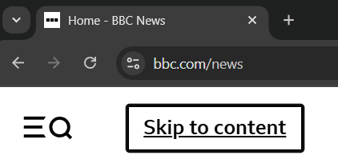
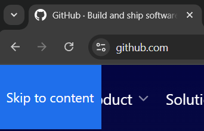
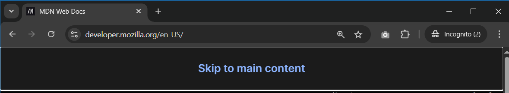
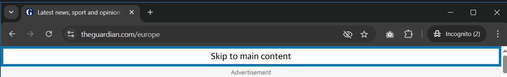
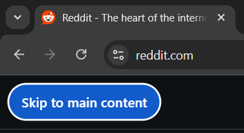
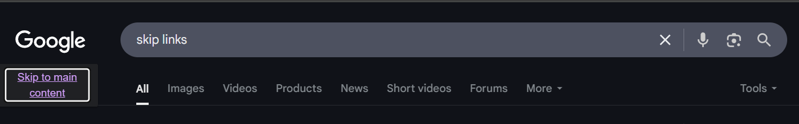

**The code to accompany this post is "[Skip links](https://github.com/anthonycosgrave/fasthtml-web-a11y/tree/main/skip_links)"**.

Many people with [motor disabilities](https://webaim.org/articles/motor/motordisabilities) navigate the web using only a keyboard. Without skip links, reaching the main content means tabbing through the same navigation menus, logos, banner ads, and social media links on every page. Unlike screen reader users who can navigate by [landmarks](/content/blog/fasthtml-web-a11y/landmarks.md), sighted keyboard-only users need a different solution.

<table-of-contents selector="h2, h3, h4, h5" summary="Overview"></table-of-contents>

## Navigating without a skip link

In the following demonstration, I *repeatedly* tab through elements to reach the main content - showing what happens without a skip link. (The page has been deliberately zoomed out to 80% for demonstration purposes).

<lite-youtube videoid="AWHn9Z5__Ic" title="No Skip Link Keyboard Navigation Example" style="background-image: url('https://i.ytimg.com/vi/AWHn9Z5__Ic/hqdefault.jpg');">
  <a href="https://youtu.be/AWHn9Z5__Ic" class="lyt-playbtn" title="Play Video">
    <span class="lyt-visually-hidden">Play Video: No Skip Link Keyboard Navigation Example</span>
  </a>
</lite-youtube>

## What is a skip link?

A skip link is an offscreen anchor link that becomes visible on keyboard focus. Skip links let keyboard users jump directly to the main content, bypassing repeated elements.

### Navigating with a skip link

In the following video, pressing `Tab` brings the skip link into focus in the top left corner. Pressing `Enter` "activates" (triggers it to navigate) the link and jumps directly to the main content. (The page has been deliberately zoomed out to 80% for demonstration purposes).

<lite-youtube videoid="uJtxcaUn8Cg" title="Skip Link Keyboard Navigation Example" style="background-image: url('https://i.ytimg.com/vi/uJtxcaUn8Cg/hqdefault.jpg');">
  <a href="https://youtu.be/uJtxcaUn8Cg" class="lyt-playbtn" title="Play Video">
    <span class="lyt-visually-hidden">Play Video: Skip Link Keyboard Navigation Example</span>
  </a>
</lite-youtube>

### Skip links and landmarks

Skip links and [landmarks](/content/blog/fasthtml-web-a11y/landmarks.md) solve related but distinct problems: landmarks help screen reader users navigate page structure, while skip links provide a visible, efficient shortcut for sighted keyboard-only users.

## The key features of a skip link

- **Focusable anchor**: An `<a>` element with an `href` pointing to the ID of the main content area. This is focusable and activates with the `Enter` key.
- **First in tab order**: Place the skip link as the **first focusable element**, ideally the first child of `<body>`.
- **Hidden until focused**: Use CSS to position the link off-screen and reveal it only when focused.

You may not have noticed them, but sites like the [BBC](https://www.bbc.com/) and [GitHub](https://github.com/) use skip links to support keyboard-only users.

  
  

## An FastHTML example

```python
Body(
    A(
        Strong('Skip to main content'), 
        href='#main-content', 
        cls='skip-link'
    ),
    ...
    Main(..., 
        id='main-content'
    )
)
    
```

Alternatively, the skip link's `href` can be set to the page's main heading, typically a `<h1>`.

```python
Body(
    A(
        Strong('Skip to main content'), 
        href='#main-heading', 
        cls='skip-link'
    ),
    ...
    Main(
        H1('Welcome!', id='main-heading'),
        ...
    )
)
    
```

### CSS to handle keyboard focus

Skip links exist in the page's markup and are initially positioned off-screen. They become visible upon receiving **keyboard focus** when the user presses `Tab` which changes their position to be on the page. This is achieved using the keyboard specific [:focus-visible](https://developer.mozilla.org/en-US/docs/Web/CSS/:focus-visible) pseudo-class. For example:

```css
.skip-link {
    position: absolute;
    top: -4.5rem; /* position off screen */
    left: 0;
    z-index: 10000; /* ensure nothing is in front of it */
    /* any additional styling ... */
    padding: 1.5rem 1.5rem;
    ...
}

/* styling to apply upon keyboard focus */
.skip-link:focus-visible {
    top: 0; /* bring into view */
    /* any additional styling ... */
    border: white 0.25rem solid;
    ...
}
```

## Provide understandable link text

The link's text should be self-explanatory. Phrases like 'Skip to main content' or 'Jump to content' clearly tell users what the link does without assuming they already know what a skip link is.

## Positioning a skip link

While styling and design are flexible, the essential point is that skip links become fully visible on **keyboard focus**. A common pattern is for the skip link to become visible in or near the *top-left corner* of the page. This keeps it easy to locate and interact with for keyboard users.  

Some sites, like the Mozilla Developer Network (MDN) and The Guardian, opt for a more prominent approach with their skip links spanning the top of the page when they receive focus. 

Below are examples of skip links from a variety of websites:   

  

  

 

  

## Multiple skip links

It is acceptable to provide more than one skip link **if** that functionality is deemed necessary. Each skip link should have a clear, distinct purpose, tied to a repeated content area.

- [Google Search](https://google.com) has 3 skip links: "Skip to main content", "Accessibility help", "Accessibility feedback".  
- [The Guardian](https://theguardian.com) has 2 skip links: a "Skip to main content" and a "Skip to navigation".  
- [MDN](https://developer.mozilla.org/) has 2 skip links: a "Skip to main content" and a "Skip to search".  

Remember the point of a skip link is to help users avoid repeated tabbing and content. Don't create a situation where you need a skip link to skip all your additional skip links!

## Always visible skip links

While most sites hide skip links until focused, they can also be permanently visible. Either approach is OK. Hidden skip links preserve visual design and avoid confusion for users who don't need them, while permanently visible skip links ensure maximum discoverability. Choose based on your design requirements and user needs.

## WCAG Success Criteria

These WCAG success criteria relate to the accessibility topics covered in this post.

**[2.1.1 Keyboard (Level A)](https://www.w3.org/WAI/WCAG22/Understanding/keyboard.html)** - All functionality must be operable using a keyboard or other assistive input, without requiring a mouse.

**[2.4.1 Bypass Blocks (Level A)](https://www.w3.org/WAI/WCAG22/Understanding/bypass-blocks.html)** - Users must have a way to skip repeated blocks of content, like navigation menus, so they can get to the main content quickly.

**[2.4.4 Link Purpose (In Context) (Level A)](https://www.w3.org/WAI/WCAG22/Understanding/link-purpose-in-context.html)** - Users should be able to understand what a link does from its text and surrounding context.  

**[2.4.9 Link Purpose (Link Only) (Level AAA)](https://www.w3.org/WAI/WCAG22/Understanding/link-purpose-link-only.html)** - Users should be able to understand what a link does from the link's text alone.